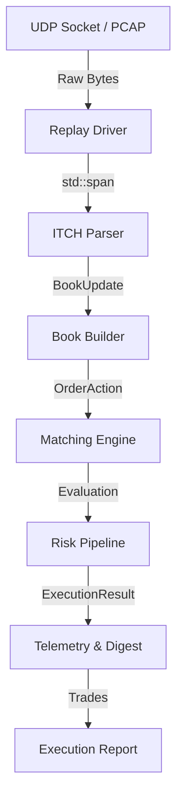
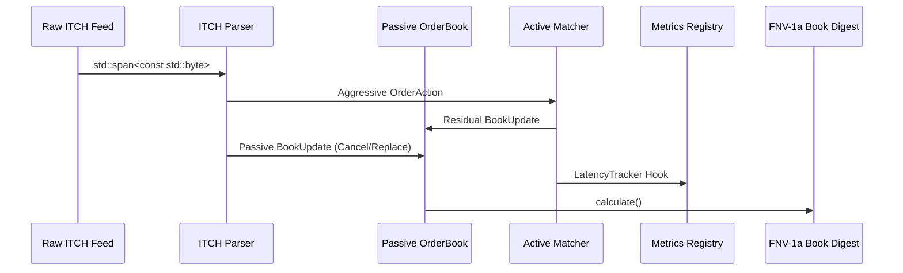

# TradeCore Architecture

TradeCore is an institutional-grade, zero-allocation Matching Engine designed for ultra-low latency execution and deterministic replay.

## 1. Overall Pipeline

The pipeline is modeled as a strictly forward-flowing sequence of transformations. During hot-path execution, the system never allocates heap memory, avoids virtual dispatch, and relies on pre-allocated contiguous memory pools.

## 2. Component Interactions

### ITCH Parser (`parser::ITCHParser`)
A zero-copy parser that extracts Nasdaq ITCH 5.0 messages from raw byte spans. It translates protocol-specific binary frames into normalized `BookUpdate` messages.
* **Design Rationale:** By keeping the parser purely functional and span-based, we completely decouple network I/O from message decoding, enabling direct PCAP `mmap` ingestion for deterministic replay.

### Risk Pipeline (`matching::RiskPipeline`)
A purely compile-time unrolled pipeline using variadic templates (`template <typename... Rules>`).
* **Design Rationale:** Traditional systems use `virtual` interfaces for risk rules, incurring `vtable` lookups on the hot path. TradeCore resolves the pipeline linearly at compile-time via C++17 fold expressions, ensuring $O(1)$ sub-nanosecond risk assertions.

### Matching Engine (`matching::MatchingEngine`)
The execution brain. It processes aggressive `OrderAction` events (Market, Limit, IOC, FOK).
* **Design Rationale:** The Matcher completely encapsulates the `OrderBook`. It sweeps resting liquidity across deep price levels while enforcing strict volume and price bijectivity via the `TRADECORE_VERIFY_EXECUTION` layer. Fills are emitted immutably to a `StaticVector`.

## 3. Replay Flow

Replay is the cornerstone of TradeCore's determinism. The engine must perfectly reconstruct the exact internal state given a historical PCAP file.

### Determinism Guarantee
The `BookDigest` executes an in-order tree traversal to produce an FNV-1a hash of the entire topological state (Price Levels + FIFO Orders). Successive runs of the Replay Engine over identical data must produce an identical hash.
