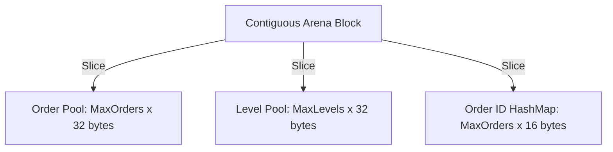

# Memory Layout & Cache Architecture

To hit deterministic sub-150ns matching latencies, TradeCore enforces aggressive spatial locality. We completely bypass the OS heap after initialization.

## 1. Zero-Allocation Arena

During initialization, TradeCore pre-allocates contiguous memory blocks for orders and price levels.



At runtime, allocations are $O(1)$ operations simply advancing an atomic integer index.

## 2. Structural Alignment and Padding

Both the `Order` struct and the `PriceLevel` struct are explicitly aligned to 32 bytes (`alignas(32)`), guaranteeing that exactly two instances pack perfectly into a standard 64-byte L1 CPU cache line.

### Order Object Layout (32 Bytes)
```text
| Offset | Size (B) | Field              | Purpose                                   |
|--------|----------|--------------------|-------------------------------------------|
| 0      | 8        | order_id           | Unique ID (Client/Exchange)               |
| 8      | 4        | price              | Limit Price                               |
| 12     | 4        | remaining_qty      | Size left to execute                      |
| 16     | 4        | next_in_level      | Pool index to next FIFO order             |
| 20     | 4        | prev_in_level      | Pool index to previous FIFO order         |
| 24     | 4        | price_level_idx    | Pool index to parent PriceLevel           |
| 28     | 4        | PADDING            | alignas(32) boundary enforcement          |
```

### PriceLevel Object Layout (32 Bytes)
```text
| Offset | Size (B) | Field              | Purpose                                   |
|--------|----------|--------------------|-------------------------------------------|
| 0      | 4        | price              | Level limit price                         |
| 4      | 4        | total_qty          | Sum of all orders in this level           |
| 8      | 4        | head_order_idx     | Start of FIFO queue                       |
| 12     | 4        | tail_order_idx     | End of FIFO queue                         |
| 16     | 4        | left_child_idx     | AVL Tree structure (Left)                 |
| 20     | 4        | right_child_idx    | AVL Tree structure (Right)                |
| 24     | 4        | parent_idx         | AVL Tree structure (Parent)               |
| 28     | 2        | height             | AVL Tree balancing metric                 |
| 30     | 2        | PADDING            | alignas(32) boundary enforcement          |
```

## 3. Cache Line Considerations

By aligning to 32 bytes:
- We never experience "cache line tearing" (where a struct spans two cache lines, doubling fetch latency).
- Traversing a PriceLevel's FIFO queue (`next_in_level`) has a 50% statistical probability of already residing in the L1 cache, significantly accelerating Market and Sweep order types.
- The `OrderBook` AVL topology ensures BBO (Best Bid/Offer) lookups are tightly clustered in memory, preventing TLB (Translation Lookaside Buffer) misses.
