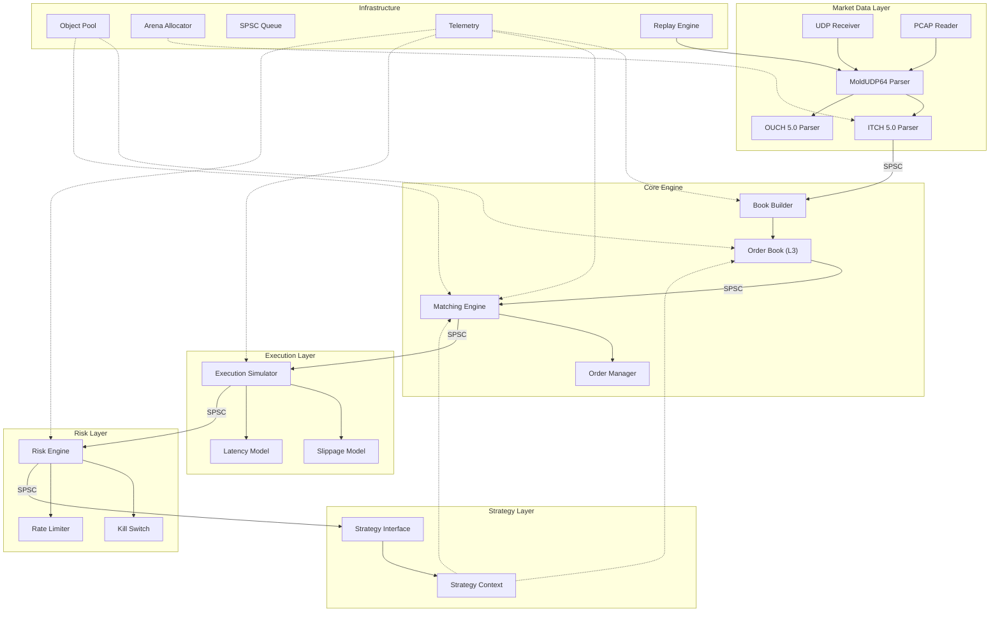

# TradeCore — Technical Architecture Document

**Ultra-Low Latency Market Microstructure Simulation & Execution Platform**
**Language:** C++23 | **Build:** CMake 3.28+ | **Target:** x86-64 Linux (primary), Windows (secondary)

---

# Table of Contents

1. [System Overview](#1-system-overview)
2. [Market Data Layer](#2-market-data-layer)
3. [Memory Architecture](#3-memory-architecture)
4. [Cache-Friendly Data Structures](#4-cache-friendly-data-structures)
5. [Order Book Engine](#5-order-book-engine)
6. [Matching Engine](#6-matching-engine)
7. [Lock-Free Architecture](#7-lock-free-architecture)
8. [Execution Simulator](#8-execution-simulator)
9. [Risk Layer](#9-risk-layer)
10. [Replay Engine](#10-replay-engine)
11. [Performance Profiling](#11-performance-profiling)
12. [Project Architecture](#12-project-architecture)
13. [UML Diagrams](#13-uml-diagrams)
14. [Development Roadmap](#14-development-roadmap)
15. [Testing Strategy](#15-testing-strategy)
16. [Documentation Structure](#16-documentation-structure)
17. [Future Extensions](#17-future-extensions)
18. [Engineering Standards](#18-engineering-standards)
19. [Standards Enforcement & Developer Tooling](#19-standards-enforcement--developer-tooling)

---

# 1. System Overview

## Pipeline

```
┌─────────────────┐
│  Raw UDP Feed /  │
│  PCAP Replay     │
└───────┬─────────┘
        │ bytes
        ▼
┌─────────────────┐
│  Packet Parser   │  ← ITCH 5.0 / OUCH 5.0 binary decode
│  (zero-copy)     │
└───────┬─────────┘
        │ typed messages
        ▼
┌─────────────────┐
│  Message Router  │  ← demux by msg type, fan-out via SPSC queues
└───────┬─────────┘
        │
   ┌────┴────┐
   ▼         ▼
┌──────┐ ┌──────────┐
│ Book │ │ Matching  │
│Engine│ │ Engine    │
└──┬───┘ └────┬─────┘
   │          │
   ▼          ▼
┌─────────────────┐
│  Execution Sim   │  ← slippage, latency injection, fill simulation
└───────┬─────────┘
        │
        ▼
┌─────────────────┐
│  Risk Layer      │  ← pre-trade checks, kill switch
└───────┬─────────┘
        │
        ▼
┌─────────────────┐
│  Strategy I/F    │  ← plugin interface for user strategies
└───────┬─────────┘
        │
        ▼
┌─────────────────┐
│  Telemetry       │  ← latency histograms, perf counters, logging
└─────────────────┘
```

## Design Principles

| Principle | Enforcement |
|---|---|
| Zero runtime allocations | Arena/pool allocators; no `new`/`malloc` on hot path |
| Cache-line awareness | 64-byte aligned structs; SoA where beneficial |
| Deterministic execution | Replay engine produces bit-identical results |
| Lock-free communication | SPSC ring buffers between pipeline stages |
| Minimal branching on hot path | Template dispatch, `[[likely]]`/`[[unlikely]]`, branchless comparisons |
| Compile-time polymorphism | CRTP and concepts over virtual dispatch |
| Measured, not assumed | Every optimization backed by benchmark data |

---

# 2. Market Data Layer

## 2.1 NASDAQ ITCH 5.0 Parser

### Protocol Summary

ITCH 5.0 is a binary, unidirectional market data feed. Messages are variable-length, prefixed by a 1-byte message type. No framing; messages are concatenated in MoldUDP64 packets.

| Message Type | Code | Size (bytes) | Frequency |
|---|---|---|---|
| System Event | `S` | 12 | Rare |
| Stock Directory | `R` | 39 | Once/day |
| Add Order | `A` | 36 | Very high |
| Add Order w/ MPID | `F` | 40 | High |
| Order Executed | `E` | 31 | High |
| Order Executed w/ Price | `C` | 36 | Medium |
| Order Cancel | `X` | 23 | High |
| Order Delete | `D` | 19 | High |
| Order Replace | `U` | 35 | High |
| Trade (Non-Cross) | `P` | 44 | Medium |
| Cross Trade | `Q` | 40 | Rare |
| Broken Trade | `B` | 19 | Rare |
| NOII | `I` | 50 | Rare |
| Stock Trading Action | `H` | 25 | Rare |
| Market Participant Pos | `L` | 26 | Rare |
| Reg SHO Restriction | `Y` | 20 | Rare |

### Parsing Strategy

**Zero-copy, in-place decode.**

1. Receive raw bytes into a preallocated receive buffer (2MB, huge-page backed).
2. MoldUDP64 header: extract `sequence_number` (8B), `message_count` (2B).
3. For each message block: read 2-byte length prefix, then 1-byte message type.
4. Dispatch to type-specific parser via jump table (array of 256 function pointers indexed by message type byte).
5. Parser reads fields at known offsets using `std::memcpy` into aligned structs — no pointer casting (strict aliasing safe).
6. Endianness: ITCH is big-endian. Convert with `std::byteswap` (C++23) or `__builtin_bswap*`.
7. Timestamp: 6-byte nanosecond offset from midnight. Stored as `uint64_t`. Convert: `(buf[0] << 40) | (buf[1] << 32) | ... | buf[5]`.

**Why jump table over switch:**

| Approach | Cost | Branch Predictor |
|---|---|---|
| `switch` | Compiler may generate jump table anyway, but not guaranteed. Large switch can degrade to cascading branches | Pollutes BTB with many targets |
| Function pointer array | Guaranteed O(1) dispatch. Single indirect call. Predictable | Single BTB entry per call site |

Jump table wins on hot paths with >10 message types.

**Why `memcpy` over reinterpret_cast:**

`reinterpret_cast<ITCHAddOrder*>(buf)` violates strict aliasing. UB. Compiler may misoptimize. `memcpy` is recognized by all major compilers and optimized to identical codegen (register loads) when sizes are small and known at compile time.

### Packet Validation

```
Validation Pipeline:
  1. MoldUDP64 header checksum (if available)
  2. Sequence number continuity check → detect gaps
  3. Message length bounds check (msg_len <= remaining_packet_bytes)
  4. Message type byte ∈ known set
  5. Field range validation (e.g., price > 0, qty > 0, stock ∈ symbol table)
  6. Timestamp monotonicity within packet
```

### Corrupted Packet Recovery

Strategy: **skip and log**.

- If message length field exceeds remaining packet bytes → discard remainder, log, increment `corrupted_packet_count`.
- If unknown message type → skip `msg_len` bytes, continue.
- If MoldUDP64 sequence gap detected → log gap range, request retransmit via SoupTCP (out-of-band), continue processing.
- Never crash on bad data. Parser must be hardened against adversarial input.

### Out-of-Order Handling

MoldUDP64 provides 64-bit sequence numbers.

- Maintain `expected_sequence` counter.
- If `received_seq == expected_seq` → process, increment.
- If `received_seq > expected_seq` → gap detected. Buffer packet in preallocated gap buffer (bounded circular buffer, 64K slots). Request retransmit.
- If `received_seq < expected_seq` → duplicate. Drop. Increment `duplicate_count`.
- Gap buffer drains in-order as missing packets arrive.
- Timeout: if gap unfilled after configurable timeout (default 100ms), skip gap, log, continue.

### OUCH 5.0 Support

OUCH is the order entry protocol (bidirectional). Simpler than ITCH.

| Message | Direction | Size |
|---|---|---|
| Enter Order | Client → Server | 49 |
| Replace Order | Client → Server | 47 |
| Cancel Order | Client → Server | 19 |
| Order Accepted | Server → Client | 66 |
| Order Replaced | Server → Client | 66 |
| Order Canceled | Server → Client | 28 |
| Order Executed | Server → Client | 41 |
| Order Rejected | Server → Client | 10 |

Same parsing strategy: jump table, `memcpy`, zero-copy. OUCH uses SoupBinTCP framing (2-byte big-endian length prefix + 1-byte packet type).

### Timestamp Architecture

```
                  ┌─────────────────────────────┐
                  │      Timestamp Type          │
                  │  uint64_t nanos_since_mid    │
                  │  (6 bytes from ITCH)         │
                  │  stored as 8 bytes aligned   │
                  └─────────────────────────────┘

  Conversion:
    wall_clock = midnight_epoch_ns + nanos_since_midnight
    For replay: timestamps are relative; no wall-clock needed.

  Resolution: nanosecond (ITCH native)
  Range:     0 .. 86,400,000,000,000 (fits in 47 bits)
  Storage:   uint64_t (8 bytes, naturally aligned)
```

Hardware timestamping: when receiving live UDP, use `SO_TIMESTAMPNS` / `CLOCK_MONOTONIC_RAW` for kernel-bypass-independent receive timestamps. Store both exchange timestamp and local receive timestamp for latency measurement.

---

# 3. Memory Architecture

## 3.1 Why Zero Runtime Allocations

`malloc` on the hot path is catastrophic:

| Operation | Typical Latency |
|---|---|
| L1 cache hit | ~1 ns |
| L2 cache hit | ~4 ns |
| L3 cache hit | ~12 ns |
| Main memory | ~65 ns |
| `malloc` (glibc, uncontended) | ~50–150 ns |
| `malloc` (glibc, contended) | ~500–5000 ns |
| Page fault | ~5,000–10,000 ns |

A single `malloc` in the hot path can dominate total message processing latency. Additionally:

- `malloc` acquires a mutex internally (even tcmalloc/jemalloc have slow paths).
- Allocator metadata fragments memory, increasing TLB and cache misses.
- Non-deterministic latency destroys P99/P999 guarantees.
- Memory fragmentation grows over time → degrading performance on long-running processes.

## 3.2 Allocator Design

### Arena Allocator

```
┌─────────────────────────────────────────────────┐
│                  Arena (2MB huge page)           │
│                                                 │
│  ┌──────┬──────┬──────┬──────┬─────────────┐   │
│  │ obj1 │ obj2 │ obj3 │ obj4 │  free space  │   │
│  └──────┴──────┴──────┴──────┴─────────────┘   │
│  ^                            ^                  │
│  base                         current            │
│                                                 │
│  allocate(size, align):                         │
│    current = align_up(current, align)           │
│    ptr = current                                │
│    current += size                              │
│    assert(current <= base + capacity)           │
│    return ptr                                   │
│                                                 │
│  reset():                                       │
│    current = base   // O(1) bulk dealloc        │
└─────────────────────────────────────────────────┘
```

**Properties:**
- O(1) allocation (pointer bump).
- O(1) deallocation (reset entire arena).
- Zero fragmentation within arena.
- No per-object metadata overhead.
- Not suitable for individual object deallocation.

**Use cases:** Per-message temporary scratch space. Packet decode buffers. Temporary string formatting.

**Backed by:** `mmap` with `MAP_HUGETLB | MAP_POPULATE` for 2MB huge pages. Pre-fault all pages at startup to avoid page faults at runtime.

### Object Pool (Slab Allocator)

```
┌───────────────────────────────────────────────────┐
│              ObjectPool<Order, 1'000'000>          │
│                                                   │
│  Storage: alignas(64) std::array<Slot, N>         │
│                                                   │
│  Slot = union { Order obj; uint32_t next_free; }  │
│                                                   │
│  Free list: intrusive singly-linked (index-based) │
│                                                   │
│  ┌────┬────┬────┬────┬────┬────┬────┐            │
│  │ O1 │free│ O3 │free│free│ O6 │free│            │
│  └────┴─┬──┴────┴─┬──┴─┬──┴────┴─┬──┘            │
│         │         │    │         │                │
│         └────────►└───►└────────►null             │
│                                                   │
│  allocate():                                      │
│    idx = free_head                                │
│    free_head = slots[idx].next_free               │
│    return &slots[idx].obj  // placement new       │
│                                                   │
│  deallocate(ptr):                                 │
│    idx = (ptr - base) / sizeof(Slot)              │
│    slots[idx].next_free = free_head               │
│    free_head = idx                                │
│                                                   │
│  O(1) alloc, O(1) dealloc, zero fragmentation    │
└───────────────────────────────────────────────────┘
```

**Properties:**
- Fixed-size objects only.
- O(1) allocate and deallocate.
- Contiguous memory → cache-friendly iteration.
- Index-based free list avoids pointer chasing across pages.
- Template parameter `N` sets capacity at compile time.

**Use cases:** `Order`, `PriceLevel`, `Execution`, `Trade` objects. Anything with dynamic lifetime but fixed size.

### Ring Buffer Allocator

For SPSC message passing. Fixed-size circular buffer. No allocations. Details in §7.

### Memory Lifetime Model

```
┌─────────────────────────────────────────────────────┐
│  Lifetime          │ Allocator     │ Examples        │
├────────────────────┼───────────────┼─────────────────┤
│  Process lifetime  │ Static/global │ Symbol table,   │
│                    │ arrays        │ config, pools   │
├────────────────────┼───────────────┼─────────────────┤
│  Session lifetime  │ Arena (large) │ Order book      │
│                    │               │ state, sessions │
├────────────────────┼───────────────┼─────────────────┤
│  Object lifetime   │ Object pool   │ Individual      │
│  (dynamic)         │               │ orders, trades  │
├────────────────────┼───────────────┼─────────────────┤
│  Message lifetime  │ Arena (small) │ Decode scratch, │
│  (per-message)     │ reset/msg     │ temp buffers    │
└─────────────────────────────────────────────────────┘
```

### Ownership Model

- **No shared ownership on hot path.** No `shared_ptr`. Ever.
- `unique_ptr` only at initialization (building the pipeline graph).
- On the hot path: raw pointers into pool-allocated storage, with pool lifetime guaranteed to exceed all references.
- Ownership is structural: the pool owns the memory, components borrow via raw pointer/index.
- Index-based references preferred over pointers where possible (32-bit index = half the pointer size = better cache utilization).

### Huge Pages

| Page Size | TLB Entries (typical) | Coverage |
|---|---|---|
| 4KB | 1536 (L1+L2) | 6MB |
| 2MB | 32 (dedicated) | 64MB |
| 1GB | 4 | 4GB |

With 4KB pages and a 100MB working set, TLB misses are frequent. 2MB huge pages reduce TLB pressure by 512×.

Configuration:
```bash
# Reserve huge pages at boot
echo 1024 > /proc/sys/vm/nr_hugepages

# Or per-NUMA-node
echo 512 > /sys/devices/system/node/node0/hugepages/hugepages-2048kB/nr_hugepages
echo 512 > /sys/devices/system/node/node1/hugepages/hugepages-2048kB/nr_hugepages
```

All large allocations (pools, ring buffers, arena backing store) use `mmap` with `MAP_HUGETLB`.

---

# 4. Cache-Friendly Data Structures

## 4.1 Target Architecture

| Parameter | Value |
|---|---|
| L1d cache line | 64 bytes |
| L1d size | 32–48 KB |
| L2 size | 256 KB – 1.25 MB |
| L3 size | per-core slice ~2MB |
| L1d latency | ~4 cycles (~1 ns) |
| L2 latency | ~12 cycles (~4 ns) |
| L3 latency | ~40 cycles (~12 ns) |
| DRAM latency | ~200 cycles (~65 ns) |

## 4.2 Order

```cpp
struct alignas(64) Order {
    uint64_t order_id;          //  8B  offset  0
    uint64_t timestamp_ns;      //  8B  offset  8
    uint32_t price;             //  4B  offset 16  (fixed-point, 4 decimal)
    uint32_t quantity;          //  4B  offset 20
    uint32_t filled_quantity;   //  4B  offset 24
    uint32_t remaining_qty;     //  4B  offset 28
    uint16_t symbol_index;      //  2B  offset 30  (index into symbol table)
    uint8_t  side;              //  1B  offset 32  (0=Buy, 1=Sell)
    uint8_t  order_type;        //  1B  offset 33  (Limit, Market, IOC, FOK)
    uint8_t  state;             //  1B  offset 34  (New, Active, Partial, Filled, Canceled)
    uint8_t  flags;             //  1B  offset 35  (hidden, post-only, etc.)
    // Intrusive list pointers for price level queue
    uint32_t next_at_price;     //  4B  offset 36  (pool index, not pointer)
    uint32_t prev_at_price;     //  4B  offset 40  (pool index)
    // Padding
    uint8_t  _pad[20];         // 20B  offset 44
    // Optional: MPID for attribution
    // char     mpid[4];       //  4B
};
// Total: 64 bytes. Exactly one cache line.
// sizeof(Order) == 64, alignof(Order) == 64.
```

**Design rationale:**
- `order_id` and `timestamp_ns` first: most frequently accessed fields for lookup and ordering.
- `price` as `uint32_t` fixed-point (price × 10000): avoids floating-point. Integer comparison is faster and deterministic. Range: 0–429,496.7295 (sufficient for all equity prices).
- `symbol_index` (16-bit) instead of 8-char stock string: saves 6 bytes, enables O(1) lookup, and the symbol table is accessed rarely (display only).
- Intrusive list pointers as pool indices (32-bit) instead of raw pointers (64-bit): saves 8 bytes, and indices are position-independent (survive pool relocation).
- `_pad` ensures exactly 64 bytes. No false sharing when orders in adjacent pool slots are accessed by different threads.

## 4.3 PriceLevel

```cpp
struct alignas(64) PriceLevel {
    uint32_t price;             //  4B  offset  0
    uint32_t total_quantity;    //  4B  offset  4  (sum of all orders at this price)
    uint32_t order_count;       //  4B  offset  8
    uint32_t head_order_idx;    //  4B  offset 12  (pool index of first order)
    uint32_t tail_order_idx;    //  4B  offset 16  (pool index of last order)
    // Intrusive tree/list pointers for price level collection
    uint32_t left_child;        //  4B  offset 20  (for sorted tree)
    uint32_t right_child;       //  4B  offset 24
    uint32_t parent;            //  4B  offset 28
    int8_t   balance;           //  1B  offset 32  (AVL balance factor, or RB color)
    uint8_t  side;              //  1B  offset 33
    uint8_t  _pad[30];         // 30B  offset 34
};
// Total: 64 bytes.
```

**Design rationale:**
- Aggregated `total_quantity` avoids traversing order list for BBO display.
- Tree pointers are pool indices → entire price level tree lives in contiguous pool memory.
- One cache line per price level. Walking the tree = one cache miss per level.

## 4.4 Trade

```cpp
struct alignas(64) Trade {
    uint64_t trade_id;          //  8B
    uint64_t timestamp_ns;      //  8B
    uint64_t buy_order_id;      //  8B
    uint64_t sell_order_id;     //  8B
    uint32_t price;             //  4B
    uint32_t quantity;          //  4B
    uint16_t symbol_index;      //  2B
    uint8_t  aggressor_side;    //  1B  (which side initiated)
    uint8_t  flags;             //  1B  (cross, auction, etc.)
    uint8_t  _pad[20];         // 20B
};
// Total: 64 bytes.
```

## 4.5 Execution Report

```cpp
struct alignas(64) Execution {
    uint64_t exec_id;           //  8B
    uint64_t order_id;          //  8B
    uint64_t timestamp_ns;      //  8B
    uint32_t exec_price;        //  4B
    uint32_t exec_quantity;     //  4B
    uint32_t leaves_quantity;   //  4B  (remaining after this fill)
    uint32_t cumulative_qty;    //  4B  (total filled so far)
    uint16_t symbol_index;      //  2B
    uint8_t  exec_type;         //  1B  (New, Fill, PartialFill, Cancel, Replace)
    uint8_t  side;              //  1B
    uint8_t  _pad[20];         // 20B
};
// Total: 64 bytes.
```

## 4.6 Packet (MoldUDP64)

```cpp
struct alignas(64) MoldUDP64Header {
    char     session[10];       // 10B
    uint64_t sequence_number;   //  8B
    uint16_t message_count;     //  2B
    uint8_t  _pad[44];         // 44B
};
// Total: 64 bytes.
// Actual MoldUDP64 header is 20 bytes; padded for alignment.
// The raw 20 bytes are memcpy'd into this struct.
```

## 4.7 BookUpdate (internal event)

```cpp
struct alignas(64) BookUpdate {
    uint64_t timestamp_ns;      //  8B
    uint64_t order_id;          //  8B
    uint32_t price;             //  4B
    uint32_t quantity;          //  4B
    uint32_t new_quantity;      //  4B  (for modify)
    uint16_t symbol_index;      //  2B
    uint8_t  update_type;       //  1B  (Add, Modify, Cancel, Execute, Delete)
    uint8_t  side;              //  1B
    uint64_t match_number;      //  8B  (for executions)
    uint64_t new_order_id;      //  8B  (for replace)
    uint8_t  _pad[16];         // 16B
};
// Total: 64 bytes.
```

## 4.8 False Sharing Avoidance

False sharing occurs when two threads write to different variables that share a cache line. The cache coherence protocol (MESI/MOESI) bounces the line between cores.

**Mitigation:**
- All per-thread counters: `alignas(64)` with padding to fill the cache line.
- Atomic variables used in cross-thread communication: each on its own cache line.
- SPSC queue head/tail indices: separated by ≥1 cache line.

```cpp
struct alignas(128) SPSCQueue {
    // Producer-owned cache line
    alignas(64) std::atomic<uint64_t> head_{0};
    // 56 bytes padding (implicit from alignas(64) of next member)

    // Consumer-owned cache line
    alignas(64) std::atomic<uint64_t> tail_{0};
    // 56 bytes padding

    // Shared (read-only after init)
    alignas(64) uint64_t capacity_;
    T* buffer_;  // pointer to preallocated ring
};
```

## 4.9 SoA vs AoS Consideration

For bulk analytics (e.g., scanning all orders for a symbol), Structure-of-Arrays (SoA) is superior:

```
AoS: [order1_64B][order2_64B][order3_64B]...
     Loading price of N orders: N cache line loads.

SoA: [price1][price2][price3]...[price_N]  ← contiguous uint32_t
     Loading price of N orders: N/16 cache line loads (16 prices per line).
```

**Decision:** Use AoS for the order pool (orders are accessed as complete units during matching). Use SoA for analytics/reporting subsystems where columnar access patterns dominate.

---

# 5. Order Book Engine

## 5.1 Data Structure Comparison

| Structure | Add | Delete | Find Best | Iterate Levels | Cache Behavior | Memory Overhead |
|---|---|---|---|---|---|---|
| `std::map` (red-black tree) | O(log N) | O(log N) | O(log N) amortized O(1) cached | O(N) in-order | **Poor**: heap-allocated nodes scattered in memory. Pointer chasing → cache miss per node. | 48B/node (libstdc++) |
| Flat sorted array | O(N) insert | O(N) delete | O(1) | O(K) contiguous | **Excellent**: contiguous. But O(N) shifts on insert/delete. | 0 overhead |
| Intrusive sorted array + pool | O(N) insert | O(1) swap-remove | O(1) | O(K) | **Excellent** if levels stay sorted. But shift cost remains. | 0 overhead |
| Hash map (`std::unordered_map`) | O(1) avg | O(1) avg | O(N) | O(N log N) sort needed | **Moderate**: open addressing OK, chaining bad. No ordered traversal. | High (load factor, buckets) |
| Skip list | O(log N) | O(log N) | O(1) cached | O(K) | **Poor**: random pointer chasing across levels. | ~2 pointers/node avg |
| Intrusive AVL/RB tree in pool | O(log N) | O(log N) | O(1) cached | O(K) in-order | **Good**: nodes contiguous in pool. Tree walk has spatial locality. | 0 (pointers are pool indices embedded in struct) |

### Recommendation: **Hybrid — Intrusive AVL tree in object pool + direct-mapped price array for BBO region**

**Justification:**

For equities, ~95% of order book activity occurs within a narrow price band around the BBO (best bid/offer). Typical spread is 1–5 ticks. Typical active price levels: 5–20 per side.

**Design:**

```
┌─────────────────────────────────────────────────┐
│              Price Level Lookup                  │
│                                                 │
│  1. Direct-mapped array for BBO ± 256 ticks     │
│     price_levels_bid[256]  (contiguous)          │
│     price_levels_ask[256]  (contiguous)          │
│     Index = price - bbo_price + 256              │
│     O(1) lookup, O(1) insert, perfect cache.     │
│                                                 │
│  2. AVL tree (in pool) for far-from-touch        │
│     Handles outlier limit orders.                │
│     Rarely accessed → cache misses acceptable.   │
│                                                 │
│  3. BBO cache: two pointers to best bid/ask      │
│     Updated on every add/cancel at top.          │
│     O(1) BBO access.                             │
└─────────────────────────────────────────────────┘
```

**Why AVL over red-black:**
- AVL is more strictly balanced → worst-case tree height is ~1.44 log₂(N) vs ~2 log₂(N) for red-black.
- With typical price level counts (< 1000), the difference is 1–2 fewer comparisons per lookup.
- AVL rebalancing is slightly more expensive but price level insertion/deletion is not on the innermost hot path (order addition at existing price levels is the hot path → O(1) via direct-mapped array).

## 5.2 L3 Reconstruction

Level 3 = individual order visibility. Each price level maintains a doubly-linked list (intrusive, index-based) of orders in FIFO (time priority) order.

```
PriceLevel (price=100.50)
  │
  head ──► Order_1 ──► Order_2 ──► Order_3 ──► null
  tail ────────────────────────────► Order_3
  total_qty = Order_1.qty + Order_2.qty + Order_3.qty
  order_count = 3
```

### Operations

| Operation | Complexity | Hot Path? | Description |
|---|---|---|---|
| Add Order | O(1) amortized | Yes | Lookup price level (O(1) if near BBO). Append order to tail of level's order list. Update aggregates. |
| Cancel Order | O(1) | Yes | Lookup order by ID (hash map, O(1)). Remove from intrusive list. Update level aggregates. If level empty, remove level. |
| Modify Order (reduce qty) | O(1) | Yes | Lookup order. Reduce qty. Update level aggregate. Order keeps time priority. |
| Modify Order (increase qty, ITCH Replace) | O(1) | Medium | Delete old, add new. Loses time priority (correct per exchange rules). |
| Execute | O(1) | Yes | Reduce top-of-book order qty. If fully filled, remove. Update level. Generate Trade. |
| Replace | O(1) + O(1) | Medium | Cancel old order_id + Add new order_id. Atomic from book perspective. |

### Order Lookup by ID

Hash map: `order_id → pool_index`.

Use open-addressing hash map with Robin Hood hashing or `std::unordered_map` (replaced with a custom flat hash map for performance).

Custom flat hash map specification:
- Open addressing, linear probing (cache-friendly).
- Power-of-2 capacity (bitwise AND for modulo).
- Load factor 0.7.
- Key: `uint64_t order_id`. Value: `uint32_t pool_index`.
- Entry size: 12 bytes + 4 bytes metadata = 16 bytes → 4 entries per cache line.
- Preallocated at startup for max expected order count (e.g., 10M).

## 5.3 Multi-Symbol Support

One `OrderBook` instance per symbol. Books stored in a flat array indexed by `symbol_index` (16-bit, supporting up to 65536 symbols).

```cpp
std::array<OrderBook, MAX_SYMBOLS> books_;  // contiguous in memory
```

Symbol index assigned from ITCH Stock Directory message (`R`) at start-of-day.

---

# 6. Matching Engine

## 6.1 Price-Time Priority

**Rules:**
1. Orders are matched at the best available price first.
2. At the same price, earlier orders (lower timestamp) are filled first.
3. The intrusive linked list at each price level inherently maintains time priority (append to tail, match from head).

## 6.2 Order Lifecycle

```
                 ┌──────────┐
         ┌──────►│ REJECTED │  (risk check fail, invalid params)
         │       └──────────┘
         │
    ┌────┴────┐     ┌──────────┐
───►│   NEW   ├────►│  ACTIVE  │◄──────────────┐
    └─────────┘     └────┬─────┘               │
                         │                     │
                    ┌────┴─────┐          ┌────┴──────┐
                    │ PARTIAL  │─────────►│  ACTIVE   │
                    │  FILL    │ (still   │ (reduced  │
                    └────┬─────┘  has     │  qty)     │
                         │        qty)    └───────────┘
                         │
                    ┌────┴─────┐
                    │  FILLED  │  (qty == 0)
                    └──────────┘

    Other terminal states:
    ┌──────────┐  ┌───────────┐
    │ CANCELED │  │  EXPIRED  │
    └──────────┘  └───────────┘
```

## 6.3 Matching Algorithm

```
match_order(incoming_order):
    if incoming_order.side == BUY:
        opposite_book = ask_levels  // sorted ascending
    else:
        opposite_book = bid_levels  // sorted descending

    while incoming_order.remaining_qty > 0:
        best_level = opposite_book.best()
        if best_level == null:
            break  // no liquidity

        if not price_crosses(incoming_order.price, best_level.price, incoming_order.side):
            break  // price doesn't match

        while incoming_order.remaining_qty > 0 AND best_level.head != null:
            resting_order = best_level.head

            fill_qty = min(incoming_order.remaining_qty, resting_order.remaining_qty)
            fill_price = resting_order.price  // price improvement to aggressor

            generate_execution(incoming_order, resting_order, fill_qty, fill_price)

            incoming_order.remaining_qty -= fill_qty
            resting_order.remaining_qty  -= fill_qty

            if resting_order.remaining_qty == 0:
                remove_order(resting_order)  // dequeue from level, return to pool

        if best_level.order_count == 0:
            remove_level(best_level)

    // Handle remaining quantity based on order type
    switch incoming_order.order_type:
        case LIMIT:  add_to_book(incoming_order)   // rest on book
        case IOC:    cancel(incoming_order)         // immediate or cancel
        case FOK:    /* should have been checked before matching */
        case MARKET: cancel(incoming_order)         // no more liquidity
```

**FOK special handling:** Before entering the match loop, scan the book to verify sufficient quantity exists at acceptable prices. If not, reject immediately without modifying any state.

## 6.4 Complexity

| Operation | Average | Worst Case |
|---|---|---|
| Match at best price | O(1) per fill | O(K) fills at single level |
| Walk price levels | O(L) levels matched | O(L) |
| Total match | O(L + K) | L=levels crossed, K=orders filled |
| BBO access | O(1) | O(1) |
| Add to book | O(1) near BBO | O(log N) far from BBO |

In practice, L=1 and K=1 for >90% of matches → effectively O(1).

## 6.5 Optimization Opportunities

1. **Branch prediction hints:** `[[likely]]` on `remaining_qty > 0` paths, `[[unlikely]]` on book-empty checks.
2. **Prefetch:** When loading resting order from pool, `__builtin_prefetch` the next order in the queue.
3. **Branchless price comparison:** `price_crosses` can be implemented as `(price - best_price) * side_sign >= 0` with side_sign ∈ {-1, +1}.
4. **Batch execution reports:** Accumulate fills in a preallocated array, flush to downstream SPSC queue once matching completes.
5. **Avoid division:** All prices are integers (fixed-point). No floating point anywhere in matching.

---

# 7. Lock-Free Architecture

## 7.1 Why Lock-Free

| Concern | Mutex | Lock-Free |
|---|---|---|
| Worst-case latency | Unbounded (priority inversion, convoy) | Bounded (CAS retry) |
| P99 latency | Spikes during contention | Predictable |
| Context switches | Yes (futex, sleep) | No |
| Cache line bouncing | Lock word + data | Data only |
| Determinism | No | Yes (for SPSC) |
| Complexity | Low | Higher |

For a latency-sensitive pipeline, mutexes are unacceptable. A single `pthread_mutex_lock` under contention can cost 5–50 µs (kernel roundtrip). Lock-free SPSC queues have consistent sub-100ns latency.

## 7.2 SPSC Ring Buffer

The primary IPC primitive. One producer, one consumer, wait-free (no CAS needed).

```
┌─────────────────────────────────────────────────┐
│         SPSC Ring Buffer (power-of-2 size)       │
│                                                 │
│  Buffer: T[capacity]  (preallocated, huge-page)  │
│                                                 │
│  head_ (producer writes, consumer reads)         │
│  tail_ (consumer writes, producer reads)         │
│                                                 │
│  Producer:                                      │
│    slot = head_.load(relaxed)                   │
│    if (slot - tail_.load(acquire)) == capacity: │
│      return false  // full                      │
│    buffer_[slot & mask_] = item                  │
│    head_.store(slot + 1, release)               │
│                                                 │
│  Consumer:                                      │
│    slot = tail_.load(relaxed)                   │
│    if slot == head_.load(acquire):              │
│      return false  // empty                     │
│    item = buffer_[slot & mask_]                  │
│    tail_.store(slot + 1, release)               │
│                                                 │
│  Properties:                                    │
│    - Wait-free (no CAS, no retry loop)          │
│    - Exactly 1 acquire + 1 release per op       │
│    - head_ and tail_ on separate cache lines    │
│    - Bitwise AND for modulo (mask = cap - 1)    │
└─────────────────────────────────────────────────┘
```

### Memory Ordering Explanation

| Variable | Producer | Consumer | Ordering |
|---|---|---|---|
| `head_` | `store(release)` | `load(acquire)` | Release-acquire: ensures buffer write is visible before head advances |
| `tail_` | `load(acquire)` | `store(release)` | Release-acquire: ensures buffer read completes before tail advances |
| `buffer_[i]` | plain write | plain read | Ordered by the acquire/release on head_/tail_ |

`relaxed` loads of own variable are safe: only one thread writes each variable.

### Sizing

Capacity should be power-of-2 and large enough to absorb producer bursts without blocking.

| Queue | Capacity | Element Size | Total Memory |
|---|---|---|---|
| Parser → BookEngine | 65536 | 64B (BookUpdate) | 4 MB |
| BookEngine → MatchingEngine | 16384 | 64B | 1 MB |
| MatchingEngine → ExecSim | 16384 | 64B (Execution) | 1 MB |
| ExecSim → Risk | 8192 | 64B | 512 KB |
| Risk → Strategy | 8192 | 64B | 512 KB |

## 7.3 MPSC Queue (for logging, telemetry)

Multiple producers (pipeline stages), single consumer (logging thread).

**Design:** Array of SPSC queues, one per producer. Consumer round-robins. Avoids atomic contention entirely.

Alternative: Lock-free MPSC using a linked list with `compare_exchange_weak` on head. But this requires per-node allocation → use an index-based intrusive list in a shared pool.

**Decision:** Array-of-SPSC for telemetry. Simpler, faster, no contention.

## 7.4 Pipeline Thread Model

```
Thread 0 (Parser):        UDP recv → parse → SPSC → 
Thread 1 (BookEngine):    ← SPSC → book update → SPSC →
Thread 2 (MatchingEngine): ← SPSC → match → SPSC →
Thread 3 (ExecSim+Risk):  ← SPSC → execute → risk check → SPSC →
Thread 4 (Strategy):      ← SPSC → user callback
Thread 5 (Telemetry):     ← MPSC (array-of-SPSC) → log/stats
Thread 6 (Replay/Control): replay driver, pause/resume
```

Each thread pinned to a dedicated CPU core via `pthread_setaffinity_np`. Isolate cores with `isolcpus` kernel parameter. Disable hyperthreading on trading cores.

---

# 8. Execution Simulator

## 8.1 Order Types

| Type | Behavior |
|---|---|
| Market | Execute immediately at best available price. No resting. |
| Limit | Execute at limit price or better. Rest if not immediately fillable. |
| IOC (Immediate-or-Cancel) | Execute immediately what's available, cancel remainder. |
| FOK (Fill-or-Kill) | Execute entire quantity immediately, or reject entirely. |

## 8.2 Simulation Features

### Slippage Model

```
Slippage sources:
  1. Market impact: large orders consume multiple price levels.
     Modeled naturally by the matching engine walking the book.

  2. Latency-induced slippage: between signal generation and order arrival,
     the book may have changed.
     Modeled by: advance book state by `latency_ns` worth of market data
     before attempting to match the order.

  3. Stochastic slippage: random component modeling queue position uncertainty.
     Configurable: disabled for deterministic replay, enabled for Monte Carlo.
```

### Latency Injection

```
┌─────────────────────────────────────────┐
│          Latency Model                  │
│                                         │
│  Components:                            │
│    wire_latency_ns    (constant)        │
│    switch_latency_ns  (constant)        │
│    kernel_latency_ns  (distribution)    │
│    app_latency_ns     (measured/const)  │
│    exchange_latency_ns (distribution)   │
│                                         │
│  Total = sum of components              │
│                                         │
│  Distributions:                         │
│    Constant: fixed value                │
│    Uniform: [min, max]                  │
│    Gaussian: N(mean, stddev)            │
│    Empirical: sampled from histogram    │
│                                         │
│  Config: YAML/JSON at startup           │
└─────────────────────────────────────────┘
```

### Fill Simulation Modes

| Mode | Description |
|---|---|
| Aggressive | Fill immediately at touch. Optimistic. |
| Passive | Queue position modeled. Fill only when sufficient volume trades through. |
| Probabilistic | Fill probability = f(queue_position, trade_volume, time). |
| Replay-exact | Use actual ITCH execution messages. Deterministic. |

### TWAP/VWAP (Future)

Interface point: `ExecutionAlgorithm` base concept.

```cpp
template<typename T>
concept ExecutionAlgorithm = requires(T algo, const BookSnapshot& snap, Timestamp now) {
    { algo.on_book_update(snap, now) } -> std::same_as<std::optional<OrderAction>>;
    { algo.on_fill(Execution{}, now) } -> std::same_as<void>;
    { algo.is_complete() } -> std::same_as<bool>;
};
```

Slice parent order into child orders over time. TWAP: uniform time slices. VWAP: weight by historical volume profile.

---

# 9. Risk Layer

## 9.1 Pre-Trade Risk Checks

All checks execute on the hot path. Must complete in < 100ns total.

```
┌─────────────────────────────────────────────────┐
│              Risk Check Pipeline                 │
│                                                 │
│  Order ──► [Size Check]                         │
│            ──► [Price Check]                    │
│            ──► [Position Limit]                 │
│            ──► [Exposure Limit]                 │
│            ──► [Rate Limit]                     │
│            ──► [Duplicate Check]                │
│            ──► PASS / REJECT                    │
│                                                 │
│  All checks are branchless where possible.      │
│  Failure at any stage → short-circuit reject.   │
└─────────────────────────────────────────────────┘
```

### Check Specifications

| Check | Logic | Latency Budget |
|---|---|---|
| Max Order Size | `qty <= max_order_size[symbol]` | < 5 ns |
| Fat Finger (Price) | `abs(price - mid_price) <= max_deviation[symbol]` | < 10 ns |
| Position Limit | `current_position[symbol] + signed_qty <= max_position[symbol]` | < 10 ns |
| Gross Exposure | `sum(abs(position * mid_price)) <= max_exposure` | < 20 ns (cached) |
| Net Exposure | `sum(position * mid_price) within bounds` | < 20 ns (cached) |
| Order Rate | `orders_in_window[symbol] < max_rate` | < 15 ns |
| Duplicate | `order_id ∉ recent_order_set` (bloom filter) | < 10 ns |

### Kill Switch

Global atomic flag. Checked first in the pipeline.

```cpp
inline bool is_killed() noexcept {
    return kill_switch_.load(std::memory_order_relaxed);
    // relaxed: eventual consistency is fine.
    // In the worst case, one extra order gets through.
}
```

Triggered by:
- Manual operator action.
- Gross loss exceeding threshold.
- Error rate exceeding threshold.
- Any risk check failing N consecutive times.

**Behavior:** When killed, reject all new orders. Cancel all outstanding orders. Log state dump. Require manual reset.

### Position Tracking

```cpp
struct alignas(64) SymbolRiskState {
    int64_t  position;           // signed, shares
    int64_t  max_long_position;
    int64_t  max_short_position;
    uint32_t orders_in_window;   // sliding window count
    uint32_t max_order_size;
    uint32_t max_price_deviation; // ticks from mid
    uint32_t mid_price;          // cached, updated on BBO change
    uint8_t  _pad[16];
};
// 64 bytes per symbol. Contiguous array indexed by symbol_index.
```

---

# 10. Replay Engine

## 10.1 Architecture

```
┌──────────────┐     ┌─────────────┐     ┌──────────────┐
│  PCAP/ITCH   │────►│   Replay    │────►│   Parser     │
│  Data File   │     │   Driver    │     │  (same as    │
└──────────────┘     └──────┬──────┘     │   live)      │
                            │            └──────────────┘
                     ┌──────┴──────┐
                     │  Timestamp  │
                     │  Controller │
                     └─────────────┘
```

### Playback Modes

| Mode | Behavior |
|---|---|
| Real-time (1×) | Respect inter-message timestamp gaps |
| Accelerated (N×) | Divide gaps by N |
| Maximum throughput | No delay. Process messages as fast as possible. For benchmarking. |
| Single-step | Process one message, pause. For debugging. |

### Determinism Guarantee

Requirements for bit-identical replay:
1. Same input data → same output trades.
2. No dependency on wall-clock time in matching/book logic.
3. All timestamps from data feed, never from `clock_gettime`.
4. Deterministic hash map iteration order (or avoid depending on it).
5. No floating-point in matching (already satisfied: integer prices).
6. Same thread scheduling → single-threaded replay mode available.

### Implementation

```
replay_loop(config):
    reader = open_data_file(config.path)
    clock  = ReplayClock(config.speed_multiplier)
    
    while msg = reader.next_message():
        if config.mode == REALTIME:
            clock.wait_until(msg.timestamp)
        
        if pause_requested.load(relaxed):
            wait_for_resume()
        
        pipeline.process(msg)
        
        stats.messages_processed++
        stats.update_latency(pipeline.last_latency())
```

### Pause/Resume

Atomic flag. Replay thread checks between messages. No mid-message pause (messages are atomic).

### Benchmarking Mode

- Disable all timing waits.
- Process messages in tight loop.
- Measure: total wall time, messages/sec, per-message latency distribution.
- Warm up: skip first N messages (configurable, default 100K) to fill caches and branch predictors.

---

# 11. Performance Profiling

## 11.1 Built-in Instrumentation

### Latency Measurement

```cpp
struct alignas(128) LatencyTracker {
    // HDR Histogram — preallocated buckets
    // Range: 1ns – 10s, 3 significant digits
    // Memory: ~20KB per tracker
    
    uint64_t counts_[BUCKET_COUNT];  // preallocated
    uint64_t total_count_;
    uint64_t min_ns_;
    uint64_t max_ns_;
    
    void record(uint64_t latency_ns) noexcept {
        auto bucket = compute_bucket(latency_ns);  // branchless
        counts_[bucket]++;
        total_count_++;
        min_ns_ = std::min(min_ns_, latency_ns);
        max_ns_ = std::max(max_ns_, latency_ns);
    }
    
    uint64_t percentile(double p) const noexcept;  // P50, P99, P999
};
```

One `LatencyTracker` per pipeline stage. Tracks:

| Metric | Measurement Point |
|---|---|
| Parse latency | Packet receive → parsed message emitted |
| Book update latency | Parsed message → book updated |
| Match latency | Incoming order → execution reports generated |
| End-to-end latency | Packet receive → strategy callback |
| Risk check latency | Order submission → risk verdict |

### Throughput Counters

```cpp
struct alignas(64) ThroughputCounter {
    std::atomic<uint64_t> count_{0};
    uint64_t _pad[7];  // fill cache line
    
    void increment() noexcept {
        count_.fetch_add(1, std::memory_order_relaxed);
    }
};
```

### Hardware Performance Counters

Read via `perf_event_open` on Linux:

| Counter | What It Measures | Why It Matters |
|---|---|---|
| `PERF_COUNT_HW_CPU_CYCLES` | CPU cycles per operation | Core efficiency |
| `PERF_COUNT_HW_CACHE_MISSES` | L1/L2/L3 misses | Data structure layout quality |
| `PERF_COUNT_HW_BRANCH_MISSES` | Mispredicted branches | Control flow efficiency |
| `PERF_COUNT_HW_INSTRUCTIONS` | Instructions retired | Code density |
| IPC (instructions/cycle) | Derived | Pipeline utilization |

## 11.2 External Tools Integration

| Tool | Purpose | When |
|---|---|---|
| Google Benchmark | Microbenchmarks per component | CI, development |
| `perf stat` | Hardware counters for full pipeline | Optimization cycles |
| `perf record` + `perf report` | CPU profiling, hotspot analysis | Optimization cycles |
| Valgrind / Cachegrind | Cache simulation, miss analysis | Deep optimization |
| AddressSanitizer (ASan) | Memory errors (buffer overflow, use-after-free) | Debug builds, CI |
| ThreadSanitizer (TSan) | Data races, lock order violations | Debug builds, CI |
| UBSan | Undefined behavior (signed overflow, alignment) | Debug builds, CI |
| LeakSanitizer (LSan) | Memory leaks | Debug builds, CI |

## 11.3 Benchmark Suite Design

```
benchmarks/
├── bm_parser.cpp          // ITCH message parse throughput
├── bm_orderbook.cpp       // Add/cancel/execute operations
├── bm_matching.cpp        // Full match cycle
├── bm_risk.cpp            // Risk check pipeline latency
├── bm_spsc_queue.cpp      // Queue throughput and latency
├── bm_allocator.cpp       // Pool alloc/dealloc vs malloc
├── bm_hash_map.cpp        // Order lookup by ID
├── bm_pipeline.cpp        // End-to-end pipeline throughput
└── bm_replay.cpp          // Replay engine throughput
```

Each benchmark:
- Uses `benchmark::DoNotOptimize` to prevent dead code elimination.
- Reports: time/op, ops/sec, bytes/sec where applicable.
- Parameterized by input size (number of orders, book depth, etc.).
- Runs with CPU frequency scaling disabled (`performance` governor).

### Regression Detection

CI stores benchmark results in JSON. Compare against baseline:
- > 5% regression → warning.
- > 10% regression → build failure.
- Track P50 and P99 independently (P99 regressions are often more important).

---

# 12. Project Architecture

## 12.1 Directory Tree

```
TradeCore/
├── CMakeLists.txt                          # Root CMake
├── CMakePresets.json                       # Build presets (Debug, Release, Sanitizer)
├── .clang-format                           # Formatting config
├── .clang-tidy                             # Linting config
├── .gitignore
├── .github/
│   └── workflows/
│       ├── ci.yml                          # Main CI pipeline
│       ├── benchmark.yml                   # Benchmark regression
│       └── release.yml                     # Release packaging
├── LICENSE
├── README.md
│
├── cmake/
│   ├── CompilerWarnings.cmake              # Warning flags
│   ├── Sanitizers.cmake                    # ASan, TSan, UBSan, LSan
│   ├── StaticAnalysis.cmake                # clang-tidy, cppcheck
│   ├── Doxygen.cmake                       # Doc generation
│   ├── GoogleTest.cmake                    # GTest fetch/find
│   ├── GoogleBenchmark.cmake               # GBenchmark fetch/find
│   └── HugePages.cmake                     # Huge page detection
│
├── include/
│   └── tradecore/
│       ├── common/
│       │   ├── types.hpp                   # Core type aliases (Price, Qty, OrderId, etc.)
│       │   ├── constants.hpp               # System-wide constants
│       │   ├── compiler.hpp                # Compiler intrinsics, hints
│       │   ├── assert.hpp                  # Custom assertions
│       │   ├── endian.hpp                  # Byte-swap utilities
│       │   ├── fixed_point.hpp             # Fixed-point price arithmetic
│       │   └── timestamp.hpp               # Timestamp type and utilities
│       │
│       ├── memory/
│       │   ├── arena_allocator.hpp         # Bump allocator
│       │   ├── object_pool.hpp             # Fixed-size slab pool
│       │   ├── ring_buffer.hpp             # Backing for SPSC queue
│       │   ├── huge_page.hpp               # Huge page mmap wrapper
│       │   ├── aligned_alloc.hpp           # Cache-aligned allocation
│       │   └── memory_resource.hpp         # PMR-compatible interface (optional)
│       │
│       ├── container/
│       │   ├── flat_hash_map.hpp           # Open-addressing hash map
│       │   ├── intrusive_list.hpp          # Index-based doubly-linked list
│       │   ├── intrusive_avl_tree.hpp      # Index-based AVL tree
│       │   ├── static_vector.hpp           # Fixed-capacity vector (no heap)
│       │   └── static_string.hpp           # Fixed-capacity string
│       │
│       ├── lockfree/
│       │   ├── spsc_queue.hpp              # Wait-free SPSC ring buffer
│       │   ├── mpsc_queue.hpp              # Array-of-SPSC MPSC
│       │   └── sequencer.hpp               # Disruptor-style sequencer (future)
│       │
│       ├── parser/
│       │   ├── itch/
│       │   │   ├── itch_parser.hpp         # ITCH 5.0 message parser
│       │   │   ├── itch_messages.hpp       # ITCH message structs
│       │   │   ├── itch_constants.hpp      # Message type codes
│       │   │   └── itch_decoder.hpp        # Field-level decode utilities
│       │   ├── ouch/
│       │   │   ├── ouch_parser.hpp         # OUCH 5.0 parser
│       │   │   ├── ouch_messages.hpp       # OUCH message structs
│       │   │   └── ouch_encoder.hpp        # OUCH message builder
│       │   ├── moldudp/
│       │   │   ├── moldudp64_parser.hpp    # MoldUDP64 framing
│       │   │   └── moldudp64_header.hpp    # Header struct
│       │   └── soup/
│       │       ├── soupbintcp_parser.hpp    # SoupBinTCP framing
│       │       └── soupbintcp_header.hpp
│       │
│       ├── orderbook/
│       │   ├── order.hpp                   # Order struct
│       │   ├── price_level.hpp             # PriceLevel struct
│       │   ├── order_book.hpp              # L3 order book
│       │   ├── book_builder.hpp            # ITCH → book update processor
│       │   ├── bbo_tracker.hpp             # Best bid/offer cache
│       │   └── symbol_table.hpp            # Symbol index ↔ ticker mapping
│       │
│       ├── matching/
│       │   ├── matching_engine.hpp         # Price-time priority matcher
│       │   ├── order_manager.hpp           # Order lifecycle management
│       │   └── trade.hpp                   # Trade struct
│       │
│       ├── execution/
│       │   ├── execution_simulator.hpp     # Fill simulation
│       │   ├── execution.hpp               # Execution report struct
│       │   ├── slippage_model.hpp          # Slippage modeling
│       │   ├── latency_model.hpp           # Latency injection
│       │   └── fill_model.hpp              # Fill probability model
│       │
│       ├── risk/
│       │   ├── risk_engine.hpp             # Pre-trade risk check pipeline
│       │   ├── risk_state.hpp              # Per-symbol risk state
│       │   ├── kill_switch.hpp             # Global kill switch
│       │   └── rate_limiter.hpp            # Order rate limiting
│       │
│       ├── strategy/
│       │   ├── strategy_interface.hpp      # CRTP strategy base
│       │   ├── strategy_context.hpp        # Market data + execution access
│       │   └── order_action.hpp            # Strategy → engine commands
│       │
│       ├── replay/
│       │   ├── replay_engine.hpp           # Deterministic replay driver
│       │   ├── replay_clock.hpp            # Virtual clock for replay
│       │   ├── pcap_reader.hpp             # PCAP file reader
│       │   └── data_reader.hpp             # Raw ITCH file reader
│       │
│       ├── telemetry/
│       │   ├── latency_tracker.hpp         # HDR histogram
│       │   ├── throughput_counter.hpp      # Atomic counter
│       │   ├── perf_counters.hpp           # HW perf counter reader
│       │   ├── statistics.hpp              # Aggregated statistics
│       │   └── logger.hpp                  # Low-latency logger (async)
│       │
│       └── pipeline/
│           ├── pipeline.hpp                # Full pipeline assembly
│           ├── pipeline_config.hpp         # Pipeline configuration
│           └── thread_affinity.hpp         # Core pinning utilities
│
├── src/
│   ├── common/
│   │   ├── timestamp.cpp
│   │   └── fixed_point.cpp
│   ├── memory/
│   │   ├── arena_allocator.cpp
│   │   ├── object_pool.cpp
│   │   └── huge_page.cpp
│   ├── parser/
│   │   ├── itch/
│   │   │   ├── itch_parser.cpp
│   │   │   └── itch_decoder.cpp
│   │   ├── ouch/
│   │   │   ├── ouch_parser.cpp
│   │   │   └── ouch_encoder.cpp
│   │   ├── moldudp/
│   │   │   └── moldudp64_parser.cpp
│   │   └── soup/
│   │       └── soupbintcp_parser.cpp
│   ├── orderbook/
│   │   ├── order_book.cpp
│   │   ├── book_builder.cpp
│   │   └── symbol_table.cpp
│   ├── matching/
│   │   ├── matching_engine.cpp
│   │   └── order_manager.cpp
│   ├── execution/
│   │   ├── execution_simulator.cpp
│   │   ├── slippage_model.cpp
│   │   └── latency_model.cpp
│   ├── risk/
│   │   ├── risk_engine.cpp
│   │   ├── kill_switch.cpp
│   │   └── rate_limiter.cpp
│   ├── replay/
│   │   ├── replay_engine.cpp
│   │   ├── replay_clock.cpp
│   │   ├── pcap_reader.cpp
│   │   └── data_reader.cpp
│   ├── telemetry/
│   │   ├── latency_tracker.cpp
│   │   ├── perf_counters.cpp
│   │   └── logger.cpp
│   └── pipeline/
│       ├── pipeline.cpp
│       └── thread_affinity.cpp
│
├── app/
│   ├── tradecore_main.cpp                  # Main entry point
│   ├── replay_tool.cpp                     # CLI replay tool
│   └── benchmark_runner.cpp                # Benchmark harness entry
│
├── tests/
│   ├── unit/
│   │   ├── common/
│   │   │   ├── test_timestamp.cpp
│   │   │   ├── test_fixed_point.cpp
│   │   │   └── test_endian.cpp
│   │   ├── memory/
│   │   │   ├── test_arena_allocator.cpp
│   │   │   ├── test_object_pool.cpp
│   │   │   └── test_huge_page.cpp
│   │   ├── container/
│   │   │   ├── test_flat_hash_map.cpp
│   │   │   ├── test_intrusive_list.cpp
│   │   │   ├── test_intrusive_avl_tree.cpp
│   │   │   └── test_static_vector.cpp
│   │   ├── lockfree/
│   │   │   ├── test_spsc_queue.cpp
│   │   │   └── test_mpsc_queue.cpp
│   │   ├── parser/
│   │   │   ├── test_itch_parser.cpp
│   │   │   ├── test_ouch_parser.cpp
│   │   │   ├── test_moldudp64.cpp
│   │   │   └── test_soupbintcp.cpp
│   │   ├── orderbook/
│   │   │   ├── test_order_book.cpp
│   │   │   ├── test_book_builder.cpp
│   │   │   ├── test_price_level.cpp
│   │   │   └── test_symbol_table.cpp
│   │   ├── matching/
│   │   │   ├── test_matching_engine.cpp
│   │   │   └── test_order_manager.cpp
│   │   ├── execution/
│   │   │   ├── test_execution_simulator.cpp
│   │   │   ├── test_slippage_model.cpp
│   │   │   └── test_latency_model.cpp
│   │   ├── risk/
│   │   │   ├── test_risk_engine.cpp
│   │   │   ├── test_kill_switch.cpp
│   │   │   └── test_rate_limiter.cpp
│   │   └── replay/
│   │       ├── test_replay_engine.cpp
│   │       └── test_replay_clock.cpp
│   │
│   ├── integration/
│   │   ├── test_parser_to_book.cpp         # Parser → Book pipeline
│   │   ├── test_book_to_matching.cpp       # Book → Matching pipeline
│   │   ├── test_full_pipeline.cpp          # End-to-end pipeline
│   │   ├── test_replay_determinism.cpp     # Replay produces same output
│   │   └── test_risk_integration.cpp       # Risk + Matching integration
│   │
│   ├── stress/
│   │   ├── stress_orderbook.cpp            # 10M+ operations
│   │   ├── stress_matching.cpp             # Sustained throughput test
│   │   ├── stress_spsc_queue.cpp           # Queue under load
│   │   └── stress_pipeline.cpp             # Full pipeline sustained
│   │
│   ├── fuzz/
│   │   ├── fuzz_itch_parser.cpp            # Fuzz ITCH parser with random bytes
│   │   ├── fuzz_ouch_parser.cpp
│   │   ├── fuzz_orderbook.cpp              # Random add/cancel/execute sequences
│   │   └── fuzz_moldudp.cpp
│   │
│   ├── property/
│   │   ├── prop_orderbook_invariants.cpp   # Book invariants hold under random ops
│   │   ├── prop_matching_fairness.cpp      # Price-time priority always respected
│   │   └── prop_risk_never_exceeded.cpp    # Limits never breached
│   │
│   └── data/
│       ├── sample_itch_messages.bin        # Known-good test vectors
│       ├── sample_ouch_messages.bin
│       └── expected_book_states.json       # Expected book state after replay
│
├── benchmarks/
│   ├── CMakeLists.txt
│   ├── bm_parser.cpp
│   ├── bm_orderbook.cpp
│   ├── bm_matching.cpp
│   ├── bm_risk.cpp
│   ├── bm_spsc_queue.cpp
│   ├── bm_allocator.cpp
│   ├── bm_hash_map.cpp
│   ├── bm_pipeline.cpp
│   └── bm_replay.cpp
│
├── examples/
│   ├── simple_strategy.cpp                 # Minimal strategy implementation
│   ├── replay_example.cpp                  # How to replay ITCH data
│   ├── book_viewer.cpp                     # Print book state
│   └── latency_report.cpp                  # Generate latency report
│
├── docs/
│   ├── architecture.md                     # This document
│   ├── developer_guide.md                  # Getting started, building, testing
│   ├── performance_guide.md                # Optimization techniques used
│   ├── memory_layout.md                    # Detailed memory map
│   ├── api_reference.md                    # Public API docs (or Doxygen)
│   ├── protocol_reference.md              # ITCH/OUCH protocol notes
│   ├── benchmark_results.md               # Latest benchmark data
│   └── diagrams/
│       ├── pipeline.mmd                    # Mermaid source
│       ├── data_flow.mmd
│       └── class_diagram.mmd
│
├── scripts/
│   ├── format.sh                           # Run clang-format on all sources
│   ├── lint.sh                             # Run clang-tidy
│   ├── benchmark.sh                        # Run benchmarks, compare to baseline
│   ├── setup_hugepages.sh                  # Configure huge pages
│   ├── pin_cores.sh                        # CPU isolation helper
│   ├── generate_docs.sh                    # Doxygen generation
│   └── pre-commit                          # Git pre-commit hook
│
├── config/
│   ├── default_config.yaml                 # Default pipeline configuration
│   ├── benchmark_config.yaml               # Benchmark-specific config
│   └── replay_config.yaml                  # Replay-specific config
│
└── third_party/
    └── README.md                           # Third-party dependency notes
```

## 12.2 CMake Structure

```cmake
# Root CMakeLists.txt
cmake_minimum_required(VERSION 3.28)
project(TradeCore VERSION 0.1.0 LANGUAGES CXX)

set(CMAKE_CXX_STANDARD 23)
set(CMAKE_CXX_STANDARD_REQUIRED ON)
set(CMAKE_CXX_EXTENSIONS OFF)

# Build options
option(TRADECORE_BUILD_TESTS "Build tests" ON)
option(TRADECORE_BUILD_BENCHMARKS "Build benchmarks" ON)
option(TRADECORE_BUILD_EXAMPLES "Build examples" ON)
option(TRADECORE_BUILD_DOCS "Build documentation" OFF)
option(TRADECORE_ENABLE_ASAN "Enable AddressSanitizer" OFF)
option(TRADECORE_ENABLE_TSAN "Enable ThreadSanitizer" OFF)
option(TRADECORE_ENABLE_UBSAN "Enable UBSanitizer" OFF)
option(TRADECORE_ENABLE_LTO "Enable Link-Time Optimization" OFF)
option(TRADECORE_USE_HUGEPAGES "Enable huge page support" ON)

include(cmake/CompilerWarnings.cmake)
include(cmake/Sanitizers.cmake)
include(cmake/StaticAnalysis.cmake)

# Library target
add_library(tradecore
    src/common/timestamp.cpp
    src/common/fixed_point.cpp
    # ... all src/ files
)
target_include_directories(tradecore PUBLIC include/)
target_compile_features(tradecore PUBLIC cxx_std_23)
tradecore_set_warnings(tradecore)

# Subdirectories
if(TRADECORE_BUILD_TESTS)
    enable_testing()
    add_subdirectory(tests)
endif()
if(TRADECORE_BUILD_BENCHMARKS)
    add_subdirectory(benchmarks)
endif()
if(TRADECORE_BUILD_EXAMPLES)
    add_subdirectory(examples)
endif()
```

---

# 13. UML Diagrams

## 13.1 Component Diagram



## 13.2 Data Flow Diagram

```
RAW BYTES (UDP/PCAP)
    │
    ▼
┌────────────────────┐
│ MoldUDP64 Deframe  │──► sequence check, gap detection
└────────┬───────────┘
         │  raw message bytes
         ▼
┌────────────────────┐
│ ITCH Message Parse │──► jump table dispatch, memcpy decode
└────────┬───────────┘
         │  typed BookUpdate events
         ▼
┌────────────────────┐
│ Book Builder       │──► route by message type
└───┬────┬────┬──────┘
    │    │    │
    ▼    ▼    ▼
  Add  Cancel Execute  ──► Order Book mutation
    │    │    │
    ▼    ▼    ▼
┌────────────────────┐
│ Order Book (L3)    │──► price level update, BBO recalc
└────────┬───────────┘
         │  book snapshots, BBO updates
         ▼
┌────────────────────┐
│ Matching Engine    │──► price-time priority match
└────────┬───────────┘
         │  Execution reports, Trade records
         ▼
┌────────────────────┐
│ Execution Simulator│──► slippage, latency, fill probability
└────────┬───────────┘
         │  simulated fills
         ▼
┌────────────────────┐
│ Risk Engine        │──► pre-trade checks, position update
└────────┬───────────┘
         │  approved executions
         ▼
┌────────────────────┐
│ Strategy Callback  │──► user-defined logic
└────────┬───────────┘
         │  order actions (new, cancel, modify)
         ▼
┌────────────────────┐
│ Order Manager      │──► lifecycle, send to Matching Engine
└────────────────────┘
```

## 13.3 Sequence Diagram — Order Execution

```
Strategy        OrderMgr      RiskEngine    MatchEngine    OrderBook
   │                │              │             │             │
   │ submit(order)  │              │             │             │
   │───────────────►│              │             │             │
   │                │ check(order) │             │             │
   │                │─────────────►│             │             │
   │                │  APPROVED    │             │             │
   │                │◄─────────────│             │             │
   │                │              │             │             │
   │                │ match(order) │             │             │
   │                │─────────────────────────►│             │
   │                │              │             │ get_best()  │
   │                │              │             │────────────►│
   │                │              │             │  PriceLevel │
   │                │              │             │◄────────────│
   │                │              │             │             │
   │                │              │   [price crosses]         │
   │                │              │             │             │
   │                │              │             │ fill()      │
   │                │              │             │────────────►│
   │                │              │             │  updated    │
   │                │              │             │◄────────────│
   │                │              │             │             │
   │                │  Execution   │             │             │
   │                │◄─────────────────────────│             │
   │                │              │             │             │
   │                │ update_pos() │             │             │
   │                │─────────────►│             │             │
   │                │              │             │             │
   │  on_fill(exec) │              │             │             │
   │◄───────────────│              │             │             │
   │                │              │             │             │
```

## 13.4 Class Relationships

```
┌─────────────────────────────────────────────────────────────┐
│                     Core Abstractions                       │
│                                                             │
│  ObjectPool<T,N>  ◄─── used by ──── OrderBook              │
│       │                                 │                   │
│       │ manages                         │ contains          │
│       ▼                                 ▼                   │
│     Order          ◄──── list ────  PriceLevel              │
│                                         │                   │
│                                         │ tree node         │
│                                         ▼                   │
│                                   IntrusiveAVLTree          │
│                                                             │
│  SPSCQueue<T>  ◄─── connects ──── Pipeline                 │
│                                     │  │  │                 │
│                          ┌──────────┘  │  └──────────┐      │
│                          ▼             ▼             ▼      │
│                     ITCHParser   MatchingEngine  RiskEngine  │
│                          │             │             │      │
│                          │ uses        │ uses        │ uses │
│                          ▼             ▼             ▼      │
│                     BookBuilder   OrderManager   RiskState   │
│                                                             │
│  ArenaAllocator  ◄─── used by ──── ITCHParser (scratch)    │
│  FlatHashMap     ◄─── used by ──── OrderBook (ID lookup)   │
│  LatencyTracker  ◄─── used by ──── all pipeline stages     │
└─────────────────────────────────────────────────────────────┘

Concept hierarchy (compile-time polymorphism):

  Parseable<T>       ──── ITCHParser, OUCHParser
  Matchable<T>       ──── PriceTimeMatcher
  RiskCheckable<T>   ──── PreTradeRiskEngine
  Executable<T>      ──── SimulatedExecutor
  Replayable<T>      ──── ReplayEngine
  StrategyBase<T>    ──── user strategies (CRTP)
```

---

# 14. Development Roadmap

## Phase 1: Foundation (Weeks 1–2)

**Objectives:**
- Project scaffolding, build system, CI.
- Core types, constants, compiler utilities.
- Custom assertions.

**Output:**
- Compiling, empty project with full CMake, clang-format, clang-tidy, GTest, GBenchmark.
- `types.hpp`, `constants.hpp`, `compiler.hpp`, `assert.hpp`, `endian.hpp`, `timestamp.hpp`, `fixed_point.hpp`.

**Dependencies:** None.

**Testing:** Static assertions on type sizes/alignments. Unit tests for endian conversion, fixed-point arithmetic, timestamp utilities.

---

## Phase 2: Memory Subsystem (Weeks 3–4)

**Objectives:**
- Arena allocator.
- Object pool (slab allocator).
- Huge page wrapper.
- Cache-aligned allocation utilities.

**Output:**
- `ArenaAllocator`, `ObjectPool<T,N>`, `HugePage`, `aligned_alloc.hpp`.

**Dependencies:** Phase 1.

**Testing:**
- Unit: alloc/dealloc correctness, pool exhaustion, arena reset.
- Benchmark: `bm_allocator.cpp` — pool alloc vs `malloc` vs `new`.
- Stress: 10M alloc/dealloc cycles, verify zero leaks.
- Sanitizer: ASan + LSan on all memory tests.

---

## Phase 3: Containers (Weeks 5–6)

**Objectives:**
- SPSC queue.
- Flat hash map.
- Intrusive doubly-linked list.
- Intrusive AVL tree.
- Static vector.

**Output:**
- All container headers in `include/tradecore/container/` and `include/tradecore/lockfree/`.

**Dependencies:** Phase 2 (containers use pool-allocated storage).

**Testing:**
- Unit: correctness for all operations, edge cases, iterator validity.
- Stress: SPSC queue under sustained producer/consumer load (separate threads).
- Benchmark: `bm_spsc_queue.cpp`, `bm_hash_map.cpp`.
- TSan: data race detection on SPSC queue.
- Property: AVL tree maintains balance invariant under random insert/delete.

---

## Phase 4: Market Data Parser (Weeks 7–9)

**Objectives:**
- MoldUDP64 deframing.
- ITCH 5.0 full message parser (all 22 message types).
- OUCH 5.0 parser/encoder.
- SoupBinTCP framing.
- Packet validation.
- Out-of-order handling.

**Output:**
- Complete parser subsystem.
- Test data: known-good binary ITCH messages.

**Dependencies:** Phase 1 (types, endian), Phase 2 (arena for scratch).

**Testing:**
- Unit: parse known messages, verify all fields.
- Fuzz: `fuzz_itch_parser.cpp` — random bytes → no crash, no UB.
- Benchmark: `bm_parser.cpp` — messages/sec on sample data.
- ASan + UBSan on all parser tests.

---

## Phase 5: Order Book (Weeks 10–13)

**Objectives:**
- `Order`, `PriceLevel` structs.
- L3 order book with add/modify/cancel/execute.
- Direct-mapped price array + AVL overflow tree.
- Order lookup hash map.
- Book builder (ITCH messages → book ops).
- BBO tracker.
- Symbol table.

**Output:**
- Fully functional order book reconstructed from ITCH data.

**Dependencies:** Phase 3 (containers), Phase 4 (parser).

**Testing:**
- Unit: each operation in isolation.
- Integration: `test_parser_to_book.cpp` — parse ITCH file, verify final book state.
- Property: book invariants (sorted prices, consistent aggregates, no orphan orders).
- Benchmark: `bm_orderbook.cpp`.
- Stress: 10M+ add/cancel operations.

---

## Phase 6: Matching Engine (Weeks 14–16)

**Objectives:**
- Price-time priority matching.
- Order manager (lifecycle).
- Trade generation.
- IOC/FOK handling.

**Output:**
- Matching engine producing correct trades.

**Dependencies:** Phase 5 (order book).

**Testing:**
- Unit: match scenarios (full fill, partial fill, no match, multi-level sweep).
- Property: price-time priority always respected.
- Benchmark: `bm_matching.cpp`.
- Integration: `test_book_to_matching.cpp`.

---

## Phase 7: Execution Simulator (Weeks 17–18)

**Objectives:**
- Slippage model.
- Latency model.
- Fill model (aggressive/passive/probabilistic).
- Execution report generation.

**Output:**
- Execution simulator with configurable models.

**Dependencies:** Phase 6 (matching engine).

**Testing:**
- Unit: each model in isolation.
- Integration: matching → execution pipeline.
- Statistical: verify slippage distribution matches configuration.

---

## Phase 8: Risk Layer (Weeks 19–20)

**Objectives:**
- Pre-trade risk check pipeline.
- Position tracking.
- Kill switch.
- Rate limiter.
- Duplicate detection.

**Output:**
- Risk engine integrated into pipeline.

**Dependencies:** Phase 6 (matching — risk checks reference book state).

**Testing:**
- Unit: each risk check in isolation.
- Integration: `test_risk_integration.cpp`.
- Property: position limits never breached.
- Benchmark: `bm_risk.cpp` (< 100ns total).

---

## Phase 9: Pipeline Assembly (Weeks 21–22)

**Objectives:**
- Wire all components via SPSC queues.
- Thread pinning.
- Pipeline configuration (YAML/JSON).
- Strategy interface (CRTP).

**Output:**
- Complete end-to-end pipeline: ITCH data → strategy callbacks.

**Dependencies:** All previous phases.

**Testing:**
- Integration: `test_full_pipeline.cpp`.
- Stress: sustained throughput test.
- Benchmark: `bm_pipeline.cpp` — end-to-end latency.

---

## Phase 10: Replay Engine (Weeks 23–24)

**Objectives:**
- PCAP reader.
- Raw ITCH data reader.
- Replay clock with speed control.
- Pause/resume.
- Deterministic replay verification.
- Benchmarking mode.

**Output:**
- Replay tool capable of replaying full trading days.

**Dependencies:** Phase 9 (complete pipeline).

**Testing:**
- Determinism: `test_replay_determinism.cpp` — same input → identical output, multiple runs.
- Benchmark: `bm_replay.cpp`.

---

## Phase 11: Telemetry & Profiling (Weeks 25–26)

**Objectives:**
- HDR histogram latency tracker.
- Throughput counters.
- HW perf counter integration.
- Async logger.
- Statistics aggregation and reporting.

**Output:**
- Full observability into pipeline performance.

**Dependencies:** Phase 9 (pipeline — telemetry hooks).

**Testing:**
- Unit: histogram accuracy.
- Integration: verify stats collected during pipeline run.

---

## Phase 12: Polish & Documentation (Weeks 27–28)

**Objectives:**
- Doxygen API reference.
- Architecture docs.
- Performance guide.
- Example programs.
- README with build instructions, benchmarks, architecture overview.
- CI hardening.

**Output:**
- Portfolio-ready repository.

**Dependencies:** All phases.

---

# 15. Testing Strategy

## Test Categories

| Category | Purpose | Runner | Frequency |
|---|---|---|---|
| Unit | Correctness of individual components | GTest | Every commit |
| Integration | Cross-component interaction | GTest | Every commit |
| Stress | Sustained load, resource exhaustion | Custom harness | Nightly |
| Fuzz | Crash/UB on adversarial input | libFuzzer | Nightly |
| Performance | Latency/throughput regression | Google Benchmark | Every PR |
| Deterministic Replay | Bit-identical output across runs | Custom | Every PR |
| Property-Based | Invariants hold under random operations | Custom + GTest | Every commit |

## Testing Principles

1. **No test may allocate on the heap** (in hot-path tests). Use the same pool allocators as production.
2. **Deterministic seeds** for any randomized test. Seed logged on failure for reproduction.
3. **Benchmark tests isolated:** run on quiet machine, CPU pinned, frequency locked.
4. **Sanitizer builds are separate CI jobs** (ASan, TSan, UBSan each as independent matrix entry).

## Property-Based Test Examples

| Property | Verification |
|---|---|
| Book invariant | `∀ price_level: total_qty == sum(order.remaining_qty for order in level)` |
| Sort invariant | `∀ adjacent levels: bid[i].price >= bid[i+1].price` |
| Conservation | `∀ match: aggressor_filled + resting_filled == trade_qty` |
| Risk invariant | `∀ accepted order: position + order_qty <= max_position` |
| FIFO | `∀ fills at same price: fill_order matches insertion order` |
| Replay determinism | `hash(output_run_1) == hash(output_run_2)` |

## Fuzz Testing

Target: parser and book builder.

```bash
# Build with fuzzing
cmake -DCMAKE_CXX_FLAGS="-fsanitize=fuzzer,address" ..

# Run
./fuzz_itch_parser -max_len=65536 -timeout=10 corpus/
```

Corpus: seed with valid ITCH messages, let fuzzer mutate. Goal: no crashes, no UB, no sanitizer findings.

---

# 16. Documentation Structure

```
docs/
├── architecture.md          # System overview, component diagram, data flow
│                            # Design decisions with quantitative justification
│
├── developer_guide.md       # Build instructions (Linux, macOS, Windows)
│                            # IDE setup (CLion, VS Code, Vim)
│                            # Running tests, benchmarks
│                            # Contributing guidelines
│                            # Code style reference
│
├── performance_guide.md     # Optimization techniques catalog
│                            # Cache-line analysis
│                            # Branch prediction strategies
│                            # Memory allocation patterns
│                            # Profiling workflow
│                            # How to interpret benchmark results
│
├── memory_layout.md         # Struct layouts with offset diagrams
│                            # Pool sizing calculations
│                            # Huge page configuration
│                            # NUMA considerations
│                            # Working set size analysis
│
├── api_reference.md         # Public API documentation (or Doxygen link)
│                            # Usage examples per class
│                            # Thread-safety annotations
│                            # Complexity guarantees
│
├── protocol_reference.md    # ITCH 5.0 message format reference
│                            # OUCH 5.0 message format reference
│                            # MoldUDP64 framing
│                            # SoupBinTCP framing
│                            # Field encoding details
│
├── benchmark_results.md     # Latest numbers with hardware specs
│                            # Comparison tables
│                            # Historical trends
│
└── diagrams/                # Mermaid, PlantUML, or ASCII source
    ├── pipeline.mmd
    ├── data_flow.mmd
    ├── class_diagram.mmd
    └── sequence_order_execution.mmd
```

---

# 17. Future Extensions

## Extension Architecture

Each extension connects via well-defined interface points already present in the design.

| Extension | Interface Point | Complexity | Notes |
|---|---|---|---|
| **FIX Protocol** | Add `FIXParser` alongside `ITCHParser`. Same `BookUpdate` output. Add `FIXEncoder` for outbound. | Medium | FIX is text-based → slower parsing. Consider FIX/FAST (binary) for performance. Tag-value parsing with preallocated field map. |
| **FPGA Acceleration** | Replace parser thread. FPGA writes directly to shared memory ring buffer. Software reads from same SPSC queue interface. | High | Requires FPGA board (Xilinx/Intel), PCIe DMA. Parser → BookUpdate structs generated in hardware. Interface: memory-mapped ring buffer. |
| **RDMA** | Replace UDP recv with RDMA read. Zero-copy into existing receive buffer. | Medium | Requires Mellanox/NVIDIA ConnectX NIC. `ibv_post_recv` → same buffer as current UDP path. Latency: ~1µs network → ~100ns RDMA. |
| **DPDK** | Replace kernel UDP stack with DPDK poll-mode driver. | Medium | Bypass kernel entirely. `rte_eth_rx_burst` → raw packets → existing MoldUDP parser. Requires dedicated NIC, hugepages (already designed for). |
| **Multi-Exchange Routing** | Add `ExchangeRouter` between `Strategy` and `OrderManager`. Symbol → exchange mapping table. Multiple book instances per symbol (arbitrage). | Medium | Router selects exchange based on BBO, latency, or strategy preference. One `OrderBook` per (symbol, exchange) pair. |
| **GPU Analytics** | Add `GPUAnalytics` module. Copy tick data to GPU via pinned memory. CUDA kernels for signal computation. Results back via pinned memory. | High | Use CUDA streams for async transfer. Compute signals (moving averages, volatility, correlation) on GPU. Feed results to strategy via SPSC queue. |
| **Distributed Simulation** | Add `NetworkTransport` layer. Serialize events via FlatBuffers/Cap'n Proto. Distribute book shards across nodes. | High | Shard by symbol hash. Each node runs subset of books. Aggregator node for cross-symbol strategies. MPI or custom TCP/RDMA transport. |
| **Real-time Visualization** | Add `WebSocketServer`. Publish BBO, trades, book depth snapshots to browser UI. | Low | Separate thread. Samples book state at configurable rate (e.g., 10Hz). No impact on hot path. D3.js or lightweight charting in browser. |
| **ML Strategy Plugins** | `StrategyInterface` already supports arbitrary logic. ML model inference via ONNX Runtime or custom C++ inference. | Medium | Feature vector: book imbalance, spread, recent trades. Model loaded at startup. Inference < 10µs for small models. Batch inference for larger models on separate thread. |

## Extensibility Mechanisms

1. **Concept-based polymorphism:** New parsers/matchers/executors satisfy the same concept → plug in at compile time.
2. **SPSC queue interface:** Any new component that produces/consumes 64-byte messages can be inserted into the pipeline.
3. **Configuration-driven:** YAML config specifies which components are active, their parameters, and pipeline wiring.
4. **Plugin directory:** `strategies/` directory compiled as separate shared libraries, loaded via `dlopen` (optional, for non-latency-critical research).

---

# 18. Engineering Standards

## 18.1 Coding Standards

### C++23 Facilities — Required Usage

| Facility | Policy | Rationale |
|---|---|---|
| `constexpr` | Use everywhere possible. All utility functions, type traits, constants. | Moves computation to compile time. Zero runtime cost. |
| `consteval` | Use for values that *must* be compile-time (table generation, hash seeds). | Compiler error if runtime evaluation attempted. |
| `noexcept` | Mandatory on all hot-path functions. Required on move constructors/assignment. | Enables compiler optimizations. Documents contract. |
| `[[nodiscard]]` | All functions returning error codes, allocated resources, computed values. | Prevents silent error ignoring. |
| `[[likely]]` / `[[unlikely]]` | On hot-path branches with known bias (e.g., error checks, empty-queue checks). | Compiler hint for code layout and branch prediction. |
| `override` / `final` | Always use `override` on virtual overrides. Use `final` on leaf classes. | Prevents silent signature mismatch. Enables devirtualization. |
| Concepts | Prefer over SFINAE. Use for template parameter constraints on public APIs. | Readable error messages. Self-documenting interfaces. |
| `std::expected` | Use for recoverable errors in non-hot-path code (config parsing, file I/O). | Modern error handling without exceptions. |
| `std::span` | Use instead of `(pointer, size)` pairs. | Bounds-safe view. Zero overhead. |
| `std::byteswap` | Endian conversion. | Standardized, portable. |

### Header/Source Organization

- **Headers (`.hpp`):** Declarations, inline functions, templates, constexpr functions.
- **Sources (`.cpp`):** Definitions that don't need to be in headers.
- **Rule:** If it's a template or constexpr, it goes in the header. Otherwise, prefer the source file (reduce compile times).
- **One class per header** (exceptions: tightly coupled small structs like `Order` + `PriceLevel`).

### Include Ordering

```cpp
// 1. Corresponding header (for .cpp files)
#include "tradecore/orderbook/order_book.hpp"

// 2. Project headers
#include "tradecore/common/types.hpp"
#include "tradecore/memory/object_pool.hpp"

// 3. Third-party headers
#include <gtest/gtest.h>

// 4. Standard library headers
#include <cstdint>
#include <array>
```

Sorted alphabetically within each group. Enforced by clang-format `IncludeCategories`.

### Namespace Conventions

```cpp
namespace tradecore {
namespace memory { ... }
namespace parser { namespace itch { ... } }
namespace orderbook { ... }
namespace matching { ... }
namespace execution { ... }
namespace risk { ... }
namespace lockfree { ... }
namespace telemetry { ... }
namespace detail { ... }    // implementation details, not public API
}
```

No `using namespace` in headers. Ever. Permitted in `.cpp` files for `tradecore` namespace only.

### Templates vs Runtime Polymorphism

| Situation | Choice | Reason |
|---|---|---|
| Hot path dispatch | Templates / CRTP / concepts | Zero overhead. Inlining. |
| Plugin interface (strategies) | CRTP with static dispatch | Still zero overhead. User recompiles. |
| Configuration-driven selection (e.g., which parser) | `std::variant` + `std::visit` | Bounded set of types, no heap allocation. |
| Truly dynamic plugins (shared libs) | Virtual functions | Only option. Not on hot path. |

**Rule:** Virtual functions are forbidden on any code path that processes market data messages.

### Preprocessor / Macros

- **Forbidden:** Function-like macros that could be `constexpr` functions or templates.
- **Permitted:** Include guards (prefer `#pragma once`), conditional compilation (`#ifdef TRADECORE_USE_HUGEPAGES`), assertion macros.
- **Required:** `TRADECORE_` prefix on all project macros.

### Prohibited Patterns

| Pattern | Reason | Alternative |
|---|---|---|
| `dynamic_cast` | RTTI overhead, design smell | `static_cast` or variant |
| `std::shared_ptr` on hot path | Atomic ref count overhead | Raw pointer + pool ownership |
| `std::string` on hot path | Heap allocation | `StaticString<N>` or `std::string_view` |
| `std::vector::push_back` on hot path | Potential reallocation | `StaticVector<T,N>` or preallocated |
| `std::map` / `std::set` | Heap alloc per node, pointer chasing | `FlatHashMap`, intrusive containers |
| `std::unordered_map` (default) | Poor cache behavior (chaining) | Custom open-addressing `FlatHashMap` |
| `std::mutex` on hot path | Kernel call under contention | Lock-free SPSC |
| Exceptions on hot path | Unwinding overhead, code bloat | Error codes, assertions |
| `std::iostream` | Slow, locale-dependent | `fmt`-style or raw write |

### Thread Safety Documentation

Every class header must document thread safety:

```cpp
/// Thread Safety: NOT thread-safe. Single-writer, single-reader assumed.
/// The producer thread calls push(). The consumer thread calls pop().
/// No external synchronization required if this contract is followed.
```

Categories: `Thread-safe`, `Not thread-safe`, `Immutable after construction`, `Single-writer/single-reader`.

## 18.2 Naming Conventions

| Entity | Convention | Example |
|---|---|---|
| Class | `PascalCase` | `OrderBook`, `MatchingEngine` |
| Struct (POD) | `PascalCase` | `Order`, `PriceLevel` |
| Interface concept | `PascalCase` adjective/noun | `Parseable`, `ExecutionAlgorithm` |
| Function | `snake_case` | `add_order()`, `get_best_bid()` |
| Member variable | `snake_case_` (trailing underscore) | `head_`, `capacity_`, `order_count_` |
| Local variable | `snake_case` | `fill_qty`, `best_price` |
| Constant (`constexpr`) | `kPascalCase` | `kMaxOrders`, `kCacheLineSize` |
| Enum (scoped) | `PascalCase` | `enum class Side { Buy, Sell }` |
| Enum value | `PascalCase` | `Side::Buy`, `OrderType::Limit` |
| Type alias | `PascalCase` | `using Price = uint32_t;` |
| Concept | `PascalCase` | `Matchable`, `RiskCheckable` |
| Template param | `PascalCase` single letter or descriptive | `T`, `Allocator`, `Derived` |
| File | `snake_case.hpp` / `.cpp` | `order_book.hpp`, `itch_parser.cpp` |
| Directory | `snake_case` | `orderbook/`, `lockfree/` |
| Namespace | `snake_case` | `tradecore::parser::itch` |
| Test | `Test_ClassName_MethodName_Scenario` | `Test_OrderBook_AddOrder_AtBestBid` |
| Benchmark | `BM_Component_Operation` | `BM_OrderBook_AddOrder` |
| Macro | `TRADECORE_UPPER_SNAKE` | `TRADECORE_ASSERT`, `TRADECORE_UNLIKELY` |

### Examples

```cpp
namespace tradecore::orderbook {

/// An L3 order book for a single symbol.
/// Thread Safety: Not thread-safe. Access from book builder thread only.
class OrderBook {
public:
    [[nodiscard]] auto add_order(const Order& order) noexcept -> bool;
    [[nodiscard]] auto cancel_order(OrderId order_id) noexcept -> bool;
    [[nodiscard]] auto get_best_bid() const noexcept -> std::optional<Price>;

    static constexpr std::size_t kMaxPriceLevels = 4096;

private:
    ObjectPool<PriceLevel, kMaxPriceLevels> level_pool_;
    FlatHashMap<OrderId, PoolIndex>         order_map_;
    Price                                    best_bid_{0};
    uint32_t                                 order_count_{0};
};

enum class Side : uint8_t { Buy = 0, Sell = 1 };
enum class OrderType : uint8_t { Limit, Market, IOC, FOK };

using OrderId = uint64_t;
using Price   = uint32_t;   // fixed-point × 10000
using Qty     = uint32_t;

}  // namespace tradecore::orderbook
```

## 18.3 Error Handling Strategy

### Philosophy

```
┌───────────────────────────────────────────────────┐
│              Error Handling Tiers                  │
│                                                   │
│  Tier 1: Hot Path (parser, book, matching)        │
│    → NO exceptions                                │
│    → Return bool / error enum                     │
│    → TRADECORE_ASSERT for invariant violations    │
│    → Log + continue on recoverable errors         │
│    → Abort on invariant violations (debug)        │
│                                                   │
│  Tier 2: Warm Path (risk, execution sim)          │
│    → Error codes via std::expected (C++23)        │
│    → No exceptions                                │
│    → Logging on all error paths                   │
│                                                   │
│  Tier 3: Cold Path (config, startup, file I/O)    │
│    → Exceptions permitted                         │
│    → std::expected also acceptable                │
│    → Full error context in exception message      │
│                                                   │
│  Tier 4: Infrastructure (logging, telemetry)      │
│    → Never throw                                  │
│    → Silent drop on failure (log buffer full)     │
│    → Must never disrupt hot path                  │
└───────────────────────────────────────────────────┘
```

### Assertions

```cpp
// Debug-only assertion (compiled out in Release)
#define TRADECORE_ASSERT(cond) \
    do { if (!(cond)) [[unlikely]] { \
        tradecore::detail::assert_fail(#cond, __FILE__, __LINE__); \
    }} while(0)

// Always-on assertion (invariant that should never be violated)
#define TRADECORE_VERIFY(cond) \
    do { if (!(cond)) [[unlikely]] { \
        tradecore::detail::verify_fail(#cond, __FILE__, __LINE__); \
    }} while(0)

// assert_fail: prints + abort (debug builds)
// verify_fail: prints + abort (all builds) — for critical invariants
```

### Corrupted Market Data

```
Corrupted ITCH message:
  1. Log warning with raw bytes (hex dump, truncated).
  2. Increment corrupted_message_count metric.
  3. Skip message.
  4. Continue processing.
  5. If corrupted_message_count > threshold in window → alert.

Invalid field values (e.g., negative price):
  1. Log warning.
  2. Skip message.
  3. Increment invalid_field_count metric.

Never crash on market data. Market data is untrusted input.
```

### Failure Behavior Summary

| Component | Failure Mode | Behavior |
|---|---|---|
| Parser | Bad packet | Skip + log + continue |
| Book Builder | Unknown symbol | Skip + log |
| Book Builder | Duplicate order ID | Skip + log + metric |
| Order Book | Pool exhausted | Reject add + log + metric |
| Matching Engine | Internal inconsistency | `TRADECORE_VERIFY` → abort |
| Risk Engine | Check failure | Reject order (normal operation) |
| Kill Switch | Triggered | Reject all orders, log state dump |
| Replay Engine | File read error | Abort replay, report error |
| Config Parser | Invalid config | Exception at startup (before hot path) |

## 18.4 API Design Guidelines

### Ownership Semantics

```
┌─────────────────────────────────────────────────┐
│  Rule: Every pointer has exactly one owner.      │
│                                                 │
│  Pool → owns memory.                            │
│  Components → borrow via raw ptr or index.      │
│  Pool outlives all borrowers (structural).       │
│                                                 │
│  unique_ptr → startup/initialization only.       │
│  shared_ptr → never on hot path.                │
│  raw ptr    → hot path borrowing from pool.      │
│  index      → preferred over raw ptr (smaller). │
└─────────────────────────────────────────────────┘
```

### Function Signatures

```cpp
// Inputs: const reference for structs, value for scalars
auto add_order(const Order& order) noexcept -> bool;
auto find_order(OrderId id) const noexcept -> const Order*;

// Outputs: return by value for small types, out-pointer for large
auto get_best_bid() const noexcept -> std::optional<Price>;
auto get_book_snapshot(BookSnapshot* out) const noexcept -> bool;

// Spans for arrays
auto process_messages(std::span<const RawMessage> messages) noexcept -> uint32_t;

// Never return non-const references to internal state on hot path.
// Const reference or copy only.
```

### Configuration

```cpp
// Builder pattern for complex configuration
auto config = PipelineConfig::builder()
    .parser(ParserType::ITCH_5_0)
    .book_depth(kMaxPriceLevels)
    .queue_capacity(65536)
    .enable_risk_checks(true)
    .latency_model(LatencyModel::constant(500))  // 500ns
    .build();  // returns std::expected<PipelineConfig, ConfigError>
```

Validated at construction. Immutable after construction. Passed by const reference.

### Callback Mechanisms

```cpp
// CRTP for zero-overhead callbacks (strategies)
template <typename Derived>
class StrategyBase {
public:
    void on_book_update(const BookSnapshot& snap) noexcept {
        static_cast<Derived*>(this)->on_book_update_impl(snap);
    }
    void on_fill(const Execution& exec) noexcept {
        static_cast<Derived*>(this)->on_fill_impl(exec);
    }
};

// User implements:
class MyStrategy : public StrategyBase<MyStrategy> {
    friend class StrategyBase<MyStrategy>;
    void on_book_update_impl(const BookSnapshot& snap) noexcept { ... }
    void on_fill_impl(const Execution& exec) noexcept { ... }
};
```

No `std::function` on hot path (heap allocation, type erasure overhead).

## 18.5 Code Review Checklist

### Mandatory — Must Pass Before Merge

| Category | Check |
|---|---|
| **Correctness** | Logic is correct. Edge cases handled. No off-by-one. |
| **Performance** | No heap allocation on hot path. No virtual calls on hot path. No `std::string` on hot path. |
| **Cache efficiency** | New structs are cache-line aligned where appropriate. No false sharing introduced. |
| **Thread safety** | Thread safety documented. No data races (TSan clean). Correct memory ordering on atomics. |
| **Memory safety** | ASan clean. No use-after-free. No buffer overflow. Pool bounds checked. |
| **Exception safety** | `noexcept` on hot path. No throwing functions called from `noexcept` context. |
| **API consistency** | Follows naming conventions. Follows ownership model. `[[nodiscard]]` where appropriate. |
| **Tests** | Unit tests for new code. Edge case tests. Integration tests if cross-component. |
| **Benchmarks** | New hot-path code has benchmark. No regression > 5%. |
| **Documentation** | Public API has Doxygen comments. Thread safety documented. Complexity documented. |

### Recommended — Should Pass

| Category | Check |
|---|---|
| **Readability** | Clear variable names. No magic numbers. Short functions. |
| **Maintainability** | No copy-paste code. DRY. Single responsibility. |
| **Compiler warnings** | Zero warnings under project warning flags. |
| **Static analysis** | clang-tidy clean. No new suppressions without justification. |

---

# 19. Standards Enforcement & Developer Tooling

## 19.1 Code Formatting — clang-format

### Configuration (`.clang-format`)

```yaml
---
Language: Cpp
BasedOnStyle: Google
Standard: c++23
ColumnLimit: 100
IndentWidth: 4
TabWidth: 4
UseTab: Never
AccessModifierOffset: -4

# Alignment
AlignAfterOpenBracket: Align
AlignConsecutiveAssignments: false
AlignConsecutiveDeclarations: false
AlignEscapedNewlines: Left
AlignOperands: true
AlignTrailingComments: true

# Braces
BreakBeforeBraces: Custom
BraceWrapping:
  AfterClass: false
  AfterControlStatement: false
  AfterEnum: false
  AfterFunction: false
  AfterNamespace: false
  AfterStruct: false
  BeforeCatch: false
  BeforeElse: false
  SplitEmptyFunction: false

# Includes
IncludeBlocks: Regroup
IncludeCategories:
  - Regex: '^"tradecore/'
    Priority: 2
  - Regex: '^<(gtest|gmock|benchmark)/'
    Priority: 3
  - Regex: '^<'
    Priority: 4
  - Regex: '.*'
    Priority: 1
SortIncludes: true

# Other
AllowShortFunctionsOnASingleLine: Inline
AllowShortIfStatementsOnASingleLine: Never
AllowShortLoopsOnASingleLine: false
DerivePointerAlignment: false
PointerAlignment: Left
SpaceAfterCStyleCast: false
SpaceAfterTemplateKeyword: true
SpaceBeforeParens: ControlStatements
...
```

### Enforcement

- **Pre-commit hook:** `clang-format --dry-run --Werror` on staged files. Blocks commit if violations found.
- **CI:** `clang-format --dry-run --Werror` on all source files. Merge-blocking.
- **IDE:** `.editorconfig` + clang-format integration for VS Code, CLion.
- **Third-party code:** Excluded via `.clang-format-ignore` or `// clang-format off/on` guards.

## 19.2 Linting — clang-tidy

### Configuration (`.clang-tidy`)

```yaml
---
Checks: >
  -*,
  bugprone-*,
  -bugprone-easily-swappable-parameters,
  cert-*,
  -cert-err58-cpp,
  clang-analyzer-*,
  concurrency-*,
  cppcoreguidelines-*,
  -cppcoreguidelines-avoid-magic-numbers,
  -cppcoreguidelines-pro-bounds-pointer-arithmetic,
  -cppcoreguidelines-pro-type-reinterpret-cast,
  -cppcoreguidelines-owning-memory,
  misc-*,
  -misc-non-private-member-variables-in-classes,
  modernize-*,
  -modernize-use-trailing-return-type,
  performance-*,
  readability-*,
  -readability-magic-numbers,
  -readability-identifier-length,
  -readability-function-cognitive-complexity,

WarningsAsErrors: >
  bugprone-use-after-move,
  bugprone-dangling-handle,
  bugprone-forward-declaration-namespace,
  bugprone-move-forwarding-reference,
  concurrency-mt-unsafe,
  performance-unnecessary-copy-initialization,
  performance-move-const-arg,
  performance-inefficient-string-concatenation,
  modernize-use-nullptr,
  modernize-use-override,

CheckOptions:
  - key: readability-identifier-naming.ClassCase
    value: CamelCase
  - key: readability-identifier-naming.FunctionCase
    value: lower_case
  - key: readability-identifier-naming.MemberCase
    value: lower_case
  - key: readability-identifier-naming.MemberSuffix
    value: '_'
  - key: readability-identifier-naming.ConstexprVariableCase
    value: CamelCase
  - key: readability-identifier-naming.ConstexprVariablePrefix
    value: 'k'
  - key: readability-identifier-naming.NamespaceCase
    value: lower_case
  - key: readability-identifier-naming.EnumCase
    value: CamelCase
  - key: readability-identifier-naming.EnumConstantCase
    value: CamelCase
  - key: performance-unnecessary-value-param.AllowedTypes
    value: ''
...
```

### Disabled Checks — Rationale

| Check | Why Disabled |
|---|---|
| `bugprone-easily-swappable-parameters` | Too noisy for functions with multiple same-type params (common in low-level code). |
| `cppcoreguidelines-avoid-magic-numbers` | Same as `readability-magic-numbers`. Constants used in protocol parsing are inherently "magic" (field offsets). Suppressed locally with comments. |
| `cppcoreguidelines-pro-bounds-pointer-arithmetic` | Pool allocators and parsers require pointer arithmetic. Unavoidable. |
| `cppcoreguidelines-pro-type-reinterpret-cast` | We use `memcpy` instead, but some platform-specific code (huge pages, perf counters) requires it. |
| `modernize-use-trailing-return-type` | Style preference. Leading return type is more readable for simple functions. |
| `readability-identifier-length` | Single-letter vars in tight loops (`i`, `n`) are acceptable. |

### Treatment

- `WarningsAsErrors` list: merge-blocking.
- All other enabled checks: reported as warnings. Must have zero warnings for merge (enforced in CI).

## 19.3 Static Analysis

### Pipeline

| Tool | Runs | Detects | Blocking |
|---|---|---|---|
| Clang Static Analyzer | CI (every PR) | Null deref, use-after-free, dead code, logic errors | High-severity only |
| ASan (AddressSanitizer) | CI (dedicated job) | Buffer overflow, heap-use-after-free, stack overflow, memory leaks | Yes |
| UBSan (UndefinedBehaviorSanitizer) | CI (with ASan) | Signed overflow, alignment violations, null deref, type punning | Yes |
| TSan (ThreadSanitizer) | CI (dedicated job, separate from ASan) | Data races, lock-order inversions | Yes |
| LSan (LeakSanitizer) | CI (with ASan) | Memory leaks | Yes |

**Note:** ASan and TSan cannot run simultaneously (incompatible instrumentation). Separate CI jobs.

### CMake Integration

```cmake
# cmake/Sanitizers.cmake
function(tradecore_enable_sanitizers target)
    if(TRADECORE_ENABLE_ASAN)
        target_compile_options(${target} PRIVATE -fsanitize=address,undefined -fno-omit-frame-pointer)
        target_link_options(${target} PRIVATE -fsanitize=address,undefined)
    endif()
    if(TRADECORE_ENABLE_TSAN)
        target_compile_options(${target} PRIVATE -fsanitize=thread)
        target_link_options(${target} PRIVATE -fsanitize=thread)
    endif()
endfunction()
```

### Local Usage

```bash
# Build with ASan + UBSan
cmake --preset=sanitize-asan && cmake --build build-asan
cd build-asan && ctest

# Build with TSan
cmake --preset=sanitize-tsan && cmake --build build-tsan
cd build-tsan && ctest
```

## 19.4 Continuous Integration

### Pipeline Design

```yaml
# .github/workflows/ci.yml (conceptual)
name: CI
on: [push, pull_request]

jobs:
  # Stage 1: Fast checks (< 2 min)
  format-check:
    runs-on: ubuntu-latest
    steps:
      - run: clang-format --dry-run --Werror $(find include src tests -name '*.hpp' -o -name '*.cpp')
    # BLOCKING

  lint:
    runs-on: ubuntu-latest
    steps:
      - run: cmake --preset=release && clang-tidy -p build $(find include src -name '*.hpp' -o -name '*.cpp')
    # BLOCKING

  # Stage 2: Build + Test (< 10 min)
  build-and-test:
    runs-on: ubuntu-latest
    strategy:
      matrix:
        compiler: [gcc-14, clang-18]
        build_type: [Debug, Release]
    steps:
      - run: cmake --preset=${{ matrix.build_type }} -DCMAKE_CXX_COMPILER=${{ matrix.compiler }}
      - run: cmake --build build -j$(nproc)
      - run: ctest --test-dir build --output-on-failure
    # BLOCKING

  # Stage 3: Sanitizers (< 15 min)
  sanitizer-asan:
    runs-on: ubuntu-latest
    steps:
      - run: cmake --preset=sanitize-asan && cmake --build build-asan -j$(nproc) && ctest --test-dir build-asan
    # BLOCKING

  sanitizer-tsan:
    runs-on: ubuntu-latest
    steps:
      - run: cmake --preset=sanitize-tsan && cmake --build build-tsan -j$(nproc) && ctest --test-dir build-tsan
    # BLOCKING

  # Stage 4: Benchmarks (< 10 min)
  benchmarks:
    runs-on: ubuntu-latest  # ideally: self-hosted bare-metal for consistency
    steps:
      - run: cmake --preset=release && cmake --build build -j$(nproc)
      - run: ./build/benchmarks/tradecore_benchmarks --benchmark_format=json > results.json
      - run: python scripts/compare_benchmarks.py baseline.json results.json --threshold=0.10
    # WARNING on > 5% regression, BLOCKING on > 10%

  # Stage 5: Docs (< 5 min)
  docs:
    runs-on: ubuntu-latest
    steps:
      - run: doxygen Doxyfile
    # WARNING only (missing docs don't block)
```

### Benchmark Regression Detection

```python
# scripts/compare_benchmarks.py (conceptual)
# Compares current benchmark JSON against stored baseline.
# Per-benchmark:
#   regression = (current_time - baseline_time) / baseline_time
#   if regression > warning_threshold (5%): WARN
#   if regression > error_threshold (10%): FAIL
# Stores new baseline on main branch merge.
```

Baselines stored in a separate `benchmarks-baseline` branch or artifact storage.

## 19.5 Pre-Commit Hooks

### Setup

```bash
#!/bin/bash
# scripts/install-hooks.sh
cp scripts/pre-commit .git/hooks/pre-commit
chmod +x .git/hooks/pre-commit
```

### Hook Script

```bash
#!/bin/bash
# scripts/pre-commit
set -e

# 1. Format check (staged files only, fast)
STAGED=$(git diff --cached --name-only --diff-filter=ACM | grep -E '\.(cpp|hpp)$')
if [ -n "$STAGED" ]; then
    echo "$STAGED" | xargs clang-format --dry-run --Werror 2>&1
    if [ $? -ne 0 ]; then
        echo "ERROR: Formatting violations. Run: scripts/format.sh"
        exit 1
    fi
fi

# 2. Lint (staged files only)
if [ -n "$STAGED" ]; then
    echo "$STAGED" | xargs clang-tidy -p build --warnings-as-errors='bugprone-use-after-move,performance-*' 2>&1
fi

# 3. License header check
for f in $STAGED; do
    if ! head -1 "$f" | grep -q "// Copyright"; then
        echo "ERROR: Missing license header in $f"
        exit 1
    fi
done

# 4. Trailing whitespace
if git diff --cached --check; then
    : # OK
else
    echo "ERROR: Trailing whitespace detected"
    exit 1
fi

# 5. No large binaries
LARGE=$(git diff --cached --name-only --diff-filter=ACM | xargs -I{} find {} -size +1M 2>/dev/null)
if [ -n "$LARGE" ]; then
    echo "ERROR: Large file detected: $LARGE"
    exit 1
fi

# 6. No debug statements
if echo "$STAGED" | xargs grep -n 'std::cout\|printf\|std::cerr' 2>/dev/null | grep -v '// DEBUG-OK'; then
    echo "WARNING: Debug output detected (add // DEBUG-OK to suppress)"
fi

# 7. No build artifacts
if git diff --cached --name-only | grep -E '(^build/|\.o$|\.a$|\.so$)'; then
    echo "ERROR: Build artifacts staged"
    exit 1
fi

echo "Pre-commit checks passed."
```

**Execution time target:** < 5 seconds for typical commits (only checks staged files).

## 19.6 Quality Gates

### Merge Requirements — Summary

| Gate | Threshold | Blocking |
|---|---|---|
| Formatting | Zero violations | **Yes** |
| Compiler warnings | Zero (under `-Wall -Wextra -Wpedantic -Werror`) | **Yes** |
| clang-tidy (WarningsAsErrors set) | Zero | **Yes** |
| clang-tidy (other checks) | Zero | **Yes** |
| Static analysis (high severity) | Zero | **Yes** |
| ASan + UBSan | Zero findings | **Yes** |
| TSan | Zero findings | **Yes** |
| Unit tests | 100% pass | **Yes** |
| Integration tests | 100% pass | **Yes** |
| Benchmark regression | < 10% slowdown | **Yes** |
| Benchmark regression | < 5% slowdown | Warning |
| Documentation (public API) | Updated | **Yes** (for API changes) |
| Code review approval | ≥ 1 reviewer | **Yes** |

### Compiler Warning Flags

```cmake
# cmake/CompilerWarnings.cmake
function(tradecore_set_warnings target)
    target_compile_options(${target} PRIVATE
        -Wall
        -Wextra
        -Wpedantic
        -Werror
        -Wshadow
        -Wnon-virtual-dtor
        -Wold-style-cast
        -Wcast-align
        -Wunused
        -Woverloaded-virtual
        -Wconversion
        -Wsign-conversion
        -Wnull-dereference
        -Wdouble-promotion
        -Wformat=2
        -Wimplicit-fallthrough
        -Wmisleading-indentation
        -Wduplicated-cond         # GCC only
        -Wduplicated-branches     # GCC only
        -Wlogical-op              # GCC only
    )
    if(CMAKE_CXX_COMPILER_ID STREQUAL "Clang")
        target_compile_options(${target} PRIVATE
            -Wno-gnu-zero-variadic-macro-arguments  # for TRADECORE_ASSERT
        )
    endif()
endfunction()
```

### CMake Presets

```json
{
  "version": 6,
  "configurePresets": [
    {
      "name": "debug",
      "binaryDir": "build-debug",
      "cacheVariables": {
        "CMAKE_BUILD_TYPE": "Debug",
        "TRADECORE_BUILD_TESTS": "ON",
        "TRADECORE_BUILD_BENCHMARKS": "OFF"
      }
    },
    {
      "name": "release",
      "binaryDir": "build-release",
      "cacheVariables": {
        "CMAKE_BUILD_TYPE": "Release",
        "CMAKE_INTERPROCEDURAL_OPTIMIZATION": "ON",
        "TRADECORE_BUILD_TESTS": "ON",
        "TRADECORE_BUILD_BENCHMARKS": "ON"
      }
    },
    {
      "name": "sanitize-asan",
      "binaryDir": "build-asan",
      "cacheVariables": {
        "CMAKE_BUILD_TYPE": "Debug",
        "TRADECORE_ENABLE_ASAN": "ON",
        "TRADECORE_BUILD_TESTS": "ON"
      }
    },
    {
      "name": "sanitize-tsan",
      "binaryDir": "build-tsan",
      "cacheVariables": {
        "CMAKE_BUILD_TYPE": "Debug",
        "TRADECORE_ENABLE_TSAN": "ON",
        "TRADECORE_BUILD_TESTS": "ON"
      }
    }
  ]
}
```

---

# Appendix A: Performance Targets

| Metric | Target | Notes |
|---|---|---|
| ITCH parse throughput | > 10M messages/sec | Single core, warm cache |
| Book update (add at existing level) | < 50 ns | Median |
| Book update (add at new level near BBO) | < 100 ns | Median |
| Match (single fill) | < 100 ns | Median |
| Match (multi-level sweep, 5 levels) | < 500 ns | Median |
| Risk check pipeline | < 100 ns | All checks combined |
| End-to-end (packet → strategy callback) | < 1 µs | Median |
| End-to-end P99 | < 5 µs | |
| End-to-end P999 | < 10 µs | |
| SPSC queue push/pop | < 15 ns | Uncontended |
| Pool allocate/deallocate | < 10 ns | |
| Memory (hot path) | 0 allocations | After initialization |

# Appendix B: Hardware Tuning Recommendations

```bash
# CPU governor
echo performance | tee /sys/devices/system/cpu/cpu*/cpufreq/scaling_governor

# Disable turbo boost (reduces latency variance)
echo 1 > /sys/devices/system/cpu/intel_pstate/no_turbo

# Isolate cores for trading threads
# Kernel boot param: isolcpus=4,5,6,7 nohz_full=4,5,6,7 rcu_nocbs=4,5,6,7

# Disable irqbalance
systemctl stop irqbalance

# Huge pages
echo 1024 > /proc/sys/vm/nr_hugepages

# Disable ASLR (deterministic replay)
echo 0 > /proc/sys/kernel/randomize_va_space

# Transparent huge pages: madvise mode
echo madvise > /sys/kernel/mm/transparent_hugepage/enabled

# Network: busy-poll for lower latency
echo 50 > /proc/sys/net/core/busy_read
echo 50 > /proc/sys/net/core/busy_poll
```
